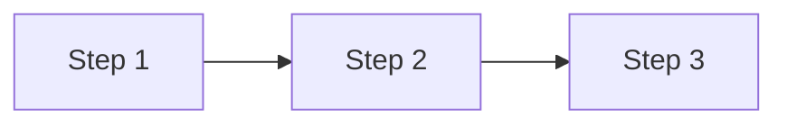

# Contributing

Thank you for your interest in improving BitcoinPrivacy.Wiki! This guide will help you get started.

---

## Getting Started

### Setup

```bash
pip install "mkdocs-material[imaging]" mkdocs-glightbox
mkdocs serve
```

Visit [localhost:8000](http://localhost:8000) to preview your changes live.

---

## Formatting

### Front Matter

```yaml
---
description: A brief description of this page (required for social media link previews)
hide:
  - navigation  # optional, hides left navigation bar
  - toc         # optional, hides right table of contents
---
```

### Admonitions

Use admonitions to highlight important information:

| Type | When to use |
|------|-------------|
| `!!! danger` | Critical privacy mistakes to avoid |
| `!!! warning` | Important caveats or trade-offs |
| `!!! tip` | Best practices and recommendations |
| `!!! info` | Supplementary explanations |
| `!!! success` | Positive signals (e.g., CoinJoin) |
| `!!! note` | General notes or asides |
| `!!! quote` | Quotes from external sources |

These can be made "collapsible" admonitions, use (`???`) for detailed explanations that not all readers need:

```markdown
??? note "View the details"

    Detailed content here, indented by 4 spaces.
```

### Content Tabs

Use tabs for alternative approaches or wallet-specific instructions:

```markdown
=== "Sparrow Wallet"

    Instructions for Sparrow.

=== "Ashigaru Wallet"

    Instructions for Ashigaru.
```

### Grid Cards

Use grid cards for overviews and best practices:

```markdown
<div class="grid cards" markdown>

-   :material-icon-name:{ .lg .middle } __Title__

    ---

    Description text.

    [Link text →](link.md)

</div>
```

### Images

- Place images in `docs/images/`
- Use `loading=lazy` for all images
- Provide dark/light variants using `#only-dark` and `#only-light` fragments:

```markdown
{ loading=lazy }
{ loading=lazy }
```

### Glossary Links

Link to glossary terms using the anchor pattern:

```markdown
[Common Input Ownership Heuristic](../glossary.md#common-input-ownership-heuristic)
```

### Math

Use LaTeX for formulas:

```markdown
$$E = \log_2(N)$$
```

### Mermaid Diagrams

Use Mermaid for flow diagrams:

```markdown

---

### References

Be sure to include references at the bottom of the page. Link to external sources, specifications, or related pages that support the content:

```markdown
## References

- [Source Name](https://example.com) — Brief description
- [Another Source](https://example.org) — Brief description
```

---

## Navigation

When adding a new page, update the `nav` section in [`mkdocs.yml`](../mkdocs.yml):

```yaml
nav:
  - Section Name:
    - Page Title: path/to/page.md
```

---

## Review Checklist

Before submitting a pull request:

- [ ] Page has a `description` in front matter
- [ ] Content is accurate and up-to-date
- [ ] All glossary terms are linked
- [ ] Images have `loading=lazy` and alt text
- [ ] Code blocks have language shortcodes
- [ ] Links to other pages use relative paths
- [ ] Page follows the established structure
- [ ] No spelling or grammar errors
- [ ] Site builds without errors (`mkdocs build`)

---

## Pull Requests

1. Fork the repository
2. Create a branch for your changes
3. Make your edits
4. Preview locally with `mkdocs serve`
5. Submit a pull request with a clear description of your changes
