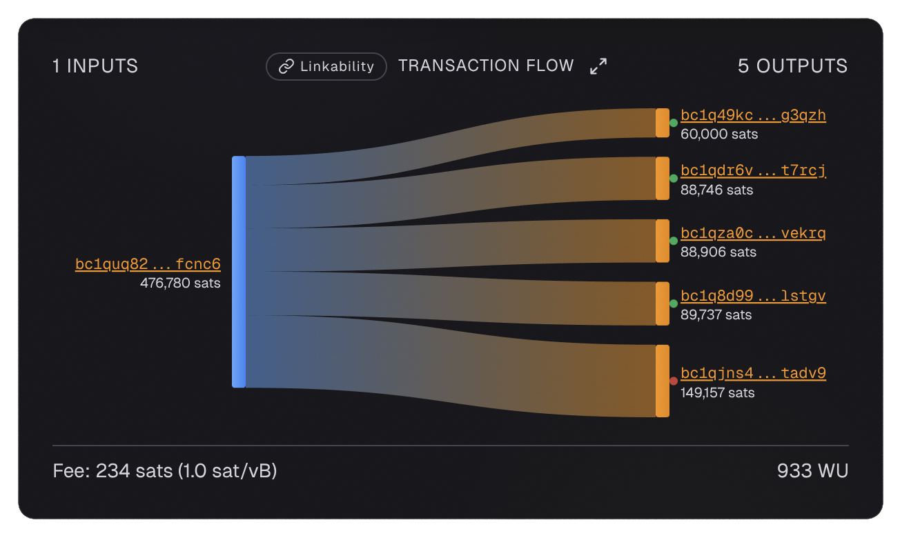
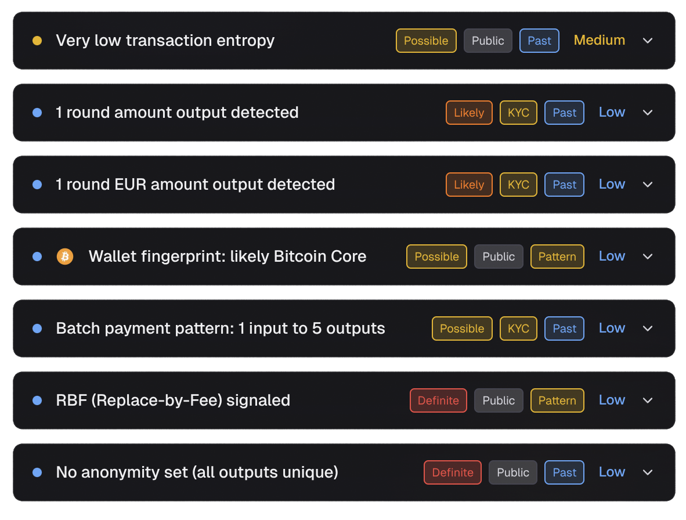

# Batch Payment

Let us start with a common transaction pattern: someone sending bitcoin to five different addresses in one transaction.

{ loading=lazy }

**Transaction ID:** [`6ae34b88...`](https://am-i.exposed/#tx=6ae34b88b5d9a3898d64264e7eb481df761b014becaf2d992e565722e596681d)

**Structure:** 1 input → 5 outputs

**Entropy:** 0 bits (only 1 valid interpretation - the single input funds all 5 outputs)

---

## What We Notice

When we scan this transaction with [am-i.exposed](../advanced/check-privacy.md), several things stand out:

{ loading=lazy }

### 1. Round Amount Output Detected

One of the five outputs is a round number - exactly 60k sats. This is a classic [round amount detection](../advanced/heuristics.md#round-amount-detection) finding.

**Why this matters:** When you send bitcoin, people typically choose a round amount like "send 0.01 BTC" or "send 100,000 sats." The [change](../glossary.md#change) other outputs, by contrast, is generally whatever is left over after subtracting the payment and the fee. Change is almost never round.

So if a transaction has multiple outputs and one is a round amount, an observer can confidently identify which output is the payment and which is the change. This breaks the ambiguity that protects the sender's privacy.

**Lesson:** Avoid sending round BTC amounts. Even adding a few random sats helps obscure the payment amount. Instead of sending exactly 60k sats, send 60,156 instead.

### 2. Round EUR Amount Output Detected

One of the outputs corresponds to a round EUR amount (EUR 100) at the BTC price when this transaction was confirmed (~EUR 66,418/BTC).

**Why this matters:** People commonly send round fiat amounts. If an analyst knows the BTC price at the time of the transaction, they can identify which output was likely the payment by matching it to round fiat values.

**Lesson:** When buying BTC, withdraw the full amount rather than a round fiat value. Add a random offset to the payment amount to obscure fiat-denominated rounding.

### 3. Bitcoin Core Wallet Fingerprint

The transaction contains clues about which [wallet](../glossary.md#wallet) software was used:

- [nLockTime](../glossary.md#nlocktime) set to block height (anti-fee-sniping)
- [nSequence](../glossary.md#nsequence) = 0xfffffffd ([RBF](../glossary.md) enabled)
- [Low-R signatures](../glossary.md#low-r-signature) (Bitcoin Core >= 0.17)

These patterns match Bitcoin Core.

**Why this matters:** Knowing the wallet helps analysts narrow down who you might be. Bitcoin Core has millions of users, so this is a large [anonymity set](../glossary.md#anonymity-set). But if you use a niche wallet with only a few hundred users, your anonymity set becomes much smaller.

**Severity:** Low

**Lesson:** Every wallet leaves a [fingerprint](../glossary.md#wallet-fingerprint). The goal is not invisibility but blending in. Wallets with millions of users create large anonymity sets where your transaction looks like millions of others. So use popular wallets ideally keeping as many configuration options default if possible.

### 4. Batch Payment Pattern

This transaction sends from 1 input to 5 outputs. This pattern is common in exchange or service batch withdrawals.

**Why this matters:** Batch payments reveal that the sender is making multiple payments simultaneously. An analyst can see that one entity controls the input and is distributing funds to five different recipients.

**Severity:** Low

**Lesson:** Batch payments are efficient but reveal payment patterns. For privacy, consider making individual transactions or using [PayJoin](../glossary.md#payjoin-p2ep).

---

## What an Analyst Can Figure Out

From this single transaction, an analyst can infer:

- The sender controls the input [UTXO](../glossary.md#utxo)
- The sender is making 5 separate payments at once
- One output is likely a round BTC amount (the payment)
- One output matches a round EUR amount
- The sender uses Bitcoin Core wallet
- All 5 output addresses are now linked to each other (they all received from the same input)

If any one of those 5 output addresses is ever linked to a real identity, the analyst now knows the sender paid that person.

---

## How to Do Better

- Use [CoinJoin](../glossary.md#coinjoin) before making batch payments
- Avoid round amounts - add random sats
- Use [PayJoin](../glossary.md#payjoin-p2ep) when possible
