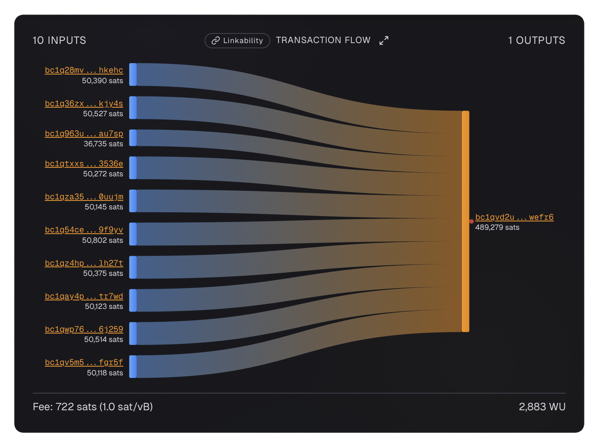
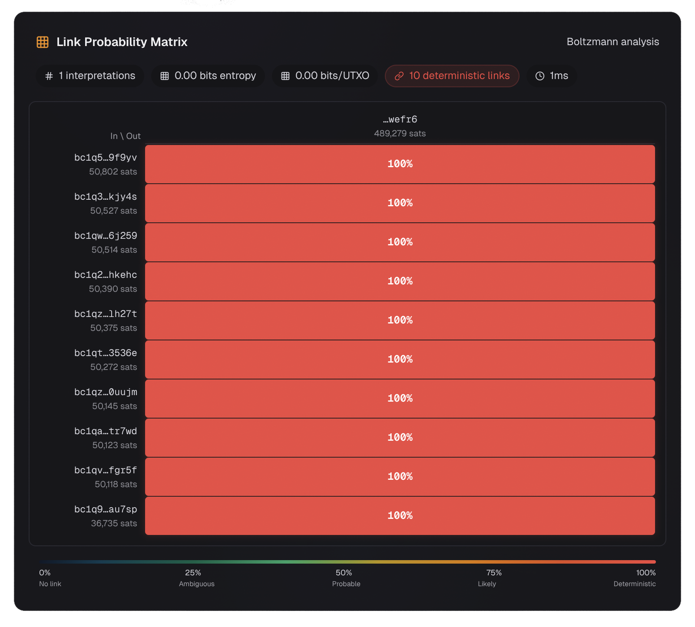

# UTXO Consolidation

Now let us look at one of the most damaging privacy mistakes you can make: consolidating many [UTXOs](../glossary.md#utxo) into one.

From a [Boltzmann entropy](../boltzmann/index.md) perspective, this is the worst possible outcome: **zero entropy, zero ambiguity**. If you have not yet read about Boltzmann entropy, we recommend starting with the [What Is Entropy?](../boltzmann/what-is-entropy.md) page to understand why this matters.

{ loading=lazy }

**Transaction ID:** `1b58afe9e2a9ecaebfca744ab93658d335cf010fbb32e7731e8126276820b8c1`

**Structure:** 10 inputs → 1 output

---

## What We Notice

This transaction takes 10 separate UTXOs and combines them into a single output. Let us look at the [Boltzmann entropy](../glossary.md#boltzmann-entropy) analysis:

{ loading=lazy }

The link probability matrix shows that every single input is 100% linked to the single output. There is zero ambiguity.

---

## Why This Is Critical

The [Common Input Ownership Heuristic](../glossary.md#common-input-ownership-heuristic) (CIOH) assumes that all inputs in a transaction belong to the same person. For this transaction, that assumption is almost certainly correct.

**What this means:** All 10 input addresses are now publicly linked together on the blockchain. If any one of those 10 addresses is ever linked to your real identity, all 10 are.

**Severity:** Critical

---

## The Boltzmann Analysis Explained

The link probability matrix above shows the probability that each input funded each output. In this case:

- There is only 1 output
- All 10 inputs must have funded that 1 output
- Therefore, every input is 100% linked to the output
- [Entropy](../glossary.md#boltzmann-entropy) = 0 bits (zero privacy)

This is the worst possible outcome for privacy. There is no ambiguity at all.

### What Is a Link Probability Matrix?

A link probability matrix answers the question: "What is the probability that input y funded output x?" for every possible pair.

For a consolidation with 10 inputs and 1 output, the matrix is simple:

| | Output 1 |
|---|---|
| Input 1 | 100% |
| Input 2 | 100% |
| Input 3 | 100% |
| ... | ... |
| Input 10 | 100% |

Every input is deterministically linked to the only output. There is exactly 1 valid interpretation of this transaction, so entropy = log2(1) = 0 bits.

---

## Lesson

**Never consolidate UTXOs unless they are already linked together.** If you must consolidate, do it through a [CoinJoin](../glossary.md#coinjoin) first.
