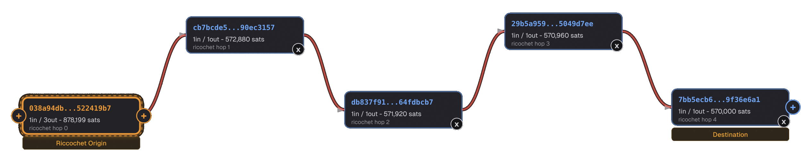
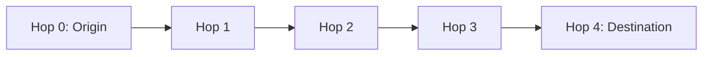

# Ricochet

Let us look at a [Ricochet](../glossary.md#ricochet) transaction chain - a privacy technique that adds "transactional distance" between your bitcoin's history and its final destination.

This example demonstrates how Ricochet works in practice. Unlike [CoinJoin](../glossary.md#coinjoin) which provides prospective anonymity (hiding what happens next), Ricochet provides **retrospective anonymity** - it creates distance from your past. For the full explanation of how Ricochet works, see the [Ricochet technique page](../techniques/ricochet.md).

## The Ricochet Chain

The image below shows a complete Ricochet chain as visualized by [am-i.exposed](https://am-i.exposed). From left to right, you can see all 5 transactions (hop 0 through hop 4) that make up this Ricochet:

{ loading=lazy }

**Interactive graph:** [View this Ricochet chain on am-i.exposed](https://am-i.exposed/graph/?network=mainnet#graph=AgAFAAAAAAADipTblJoVymges2qo15EsVxVUoJirQK7e400UUiQZtwAA__8Ay3vN5XNBDuKW6ekJS9HAIWNn6hIhJEAPzRKEo5DsMVcBAQAAAtuDf5F2KiNiKqIugLKzsmhoH8DPMrZ6tQt0-URk_by3AgEAAQAptalZJCJ8Efcewo-gcPGbSjqTvxOxH41nMUfVUEnX7gMBAAIAe7XstuOLj2F6j7ly48Xp_0eHUAbFVQQsMS30KZ825qEEAQADAAAFAADCCjJBQzD0BwABQ1i56UJQxAgAAkPl-fpDJ6E0AANEMHGZQjnxBgAERHCJF0MjmjIAAgAAEFJpY2NvY2hldCBPcmlnaW4ABAtEZXN0aW5hdGlvbgAAAAA)

---

## What We Notice

This Ricochet chain consists of **5 transactions** (hops 0 through 4):

| Hop | Transaction ID | Structure | Description |
|-----|----------------|-----------|-------------|
| **Hop 0** | [`038a94db...`](https://am-i.exposed/#tx=038a94db949a15ca681eb36aa8d7912c571554a098ab40aedee34d14522419b7) | 1 input → 3 outputs | Origin: 100,000 sat service fee + 204,359 sats change + 573,840 sats to hop 1 |
| **Hop 1** | [`cb7bcde5...`](https://am-i.exposed/#tx=cb7bcde573410ee296e9e9094bd1c0216367ea122124400fcd1284a390ec3157) | 1 input → 1 output | Self-payment: 572,880 sats (miner fee deducted) |
| **Hop 2** | [`db837f91...`](https://am-i.exposed/#tx=db837f91762a23622aa22e80b2b3b268681fc0cf32b67ab50b74f94464fdbcb7) | 1 input → 1 output | Self-payment: 571,920 sats (miner fee deducted) |
| **Hop 3** | [`29b5a959...`](https://am-i.exposed/#tx=29b5a95924227c11f71ec28fa070f19b4a3a93bf13b11f8d673147d55049d7ee) | 1 input → 1 output | Self-payment: 570,960 sats (miner fee deducted) |
| **Hop 4** | [`7bb5ecb6...`](https://am-i.exposed/#tx=7bb5ecb6e38b8f617a8fb972e3c5e9ff47875006c555042c312df4299f36e6a1) | 1 input → 1 output | Final destination: 570,000 sats delivered |

### Key Observations

- **Hop 0 is detectable**: The 100,000 sat service fee is sent to a known Ashigaru address (`bc1qsc887pxce0r3qed50e8he49a3amenemgptakg2`). This is the fingerprint that allows chain analysis to identify this as a Ricochet.
- **Hops 1-3 are simple**: Each is a straightforward 1-input, 1-output transaction. The amount decreases slightly at each hop (approximately 960 sats) due to miner fees.
- **Hop 4 delivers to destination**: The final hop sends the remaining amount to the intended recipient (in this case, likely an exchange).
- **Consecutive blocks**: All hops were confirmed in consecutive blocks (933,680 through 933,684), indicating this is the "Classic" variant rather than "Staggered Delivery."

---

## How Ricochet Works

### The Problem It Solves

When you perform a [CoinJoin](../glossary.md#coinjoin), your mixed coins are private going forward - but they carry a label. Chain analysis tools can detect CoinJoin patterns and tag coins that exit them. Think of it like encryption: you cannot read the original text, but you can tell encryption was applied.

This "coinjoined" label can affect [fungibility](../glossary.md#fungibility). Regulated entities like exchanges may refuse CoinJoin-sourced [UTXOs](../glossary.md#utxo), demand explanations, or even freeze accounts.

### The Ricochet Solution

Ricochet creates **transactional distance** by inserting 4 self-payments between your CoinJoin output and the final destination. Each hop sends funds to a fresh address you control, simulating a change of ownership.

### Why 4 Hops?

Chain analysis companies face an optimization dilemma. They must choose a threshold for how many hops back they inspect. Raising that threshold increases **false positives** exponentially - wrongly flagging innocent people as CoinJoin participants when someone else did the CoinJoin earlier in the chain. Too many false positives drive customers to competitors.

Four hops is often enough to defeat their heuristics while keeping false positives manageable.

---

## Ricochet Variants

=== "Classic Ricochet"

    All 5 transactions are broadcast together and confirmed in consecutive blocks. The service fee (100,000 sats for Ashigaru) is paid as a single output in hop 0 to a known, reused address.

    **Detectable:** Yes - the reused fee address is a clear on-chain fingerprint.

=== "Staggered Delivery (Reinforced Ricochet)"

    Each transaction is broadcast at a different time and confirmed in a different block. The service fee is split across hops 1-4 in randomized amounts sent to unique [BIP47](../glossary.md#bip-bitcoin-improvement-proposal)-derived addresses.

    **Detectable:** Very difficult - no reused address, randomized amounts, and temporal separation make this variant practically undetectable.

!!! tip "Choose Staggered for Best Privacy"

    If you are not in a hurry, always choose Staggered Delivery. The Classic variant (shown in this example) is detectable by design.

---

## What an Analyst Can Figure Out

From this Ricochet chain, an analyst can determine:

- **This is a Ricochet**: The 100,000 sat payment to the known Ashigaru fee address identifies hop 0 immediately
- **The full chain**: Once hop 0 is identified, hops 1-4 can be traced by following the 1-input, 1-output pattern
- **The final destination**: Hop 4 reveals where the funds ultimately went
- **The variant used**: Consecutive blocks indicate Classic Ricochet, not Staggered Delivery

**What they cannot determine:**

- **Who performed the Ricochet**: The origin address may or may not be linked to a real identity
- **Why Ricochet was used**: It could be after a CoinJoin, or simply for general privacy
- **The original source**: If the origin UTXO was well-mixed, tracing backward yields nothing

---

## Conclusion

This Ricochet example shows the **Classic variant without PayNym** - which is detectable by design. The reused fee address (`bc1qsc887pxce0r3qed50e8he49a3amenemgptakg2`) is a clear fingerprint that any chain analysis tool can spot.

**What could have been done better:**

- **Use Staggered Delivery**: Broadcasting each hop in a different block at different times makes the chain much harder to detect
- **Use PayNym fee splitting**: Splitting the service fee across hops using unique BIP47-derived addresses eliminates the reused address fingerprint (This is automated with staggered delivery).
- **Combine with other techniques**: Using Ricochet after a CoinJoin and with [Tor](../glossary.md#tor) provides layered privacy

**The key takeaway:** Ricochet is a pragmatic tool for increasing **retrospective anonymity** by adding distance. It does not guarantee acceptance by any third party, but it commonly reduces friction with blacklist heuristics. Ideally, avoid sending CoinJoin-sourced coins to regulated entities altogether - but if you must, Ricochet could help.

---

## References

- [Ricochet technique page](../techniques/ricochet.md) - How to use Ricochet in Ashigaru
- [BIP47 PayNyms](../techniques/address-reuse/bip47.md) - Reusable payment codes for private receiving
- [am-i.exposed](https://am-i.exposed) - Bitcoin privacy scanner used to analyze this transaction
- [PlanB Academy](https://planb.academy/en/tutorials/privacy/on-chain/ashigaru-ricochet-e0bb1afe-becd-44a6-a940-88a463756589)
