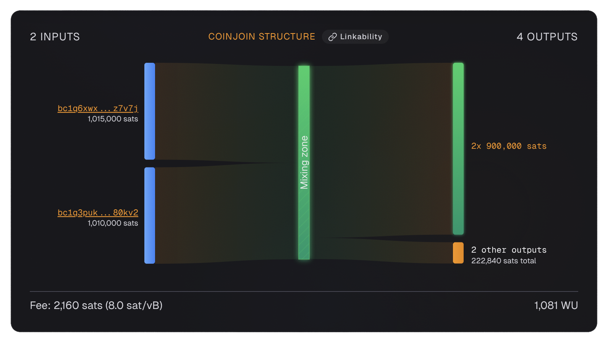
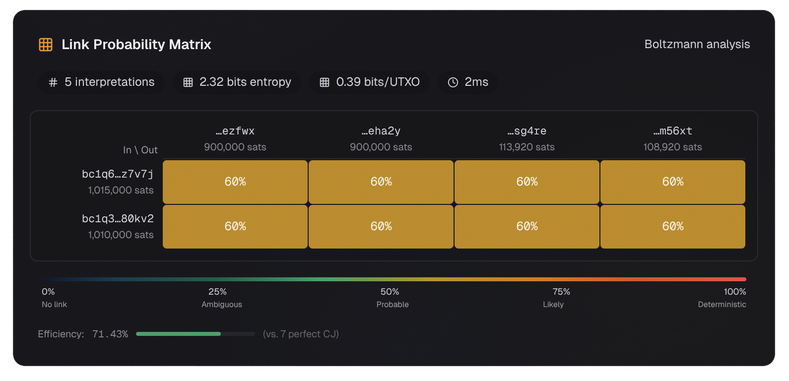

# Stonewall

Let us look at a [Stonewall](../glossary.md#stonewall) transaction - a technique that creates a transaction indistinguishable from a 2-party [CoinJoin](../glossary.md#coinjoin), but performed by a single user.

Here is the example we will be looking at:
{ loading=lazy }

**Transaction ID:** [`5c038364...`](https://am-i.exposed/#tx=5c0383645b1df5d841323406b2d58651a7d41fd52530c85f20b5ad981072001f)

**Structure:** 2 inputs → 4 outputs (2 equal outputs of 900,000 sats + 2 other change outputs)

---

## What We Notice

This transaction has 2 inputs and 4 outputs, with 2 outputs being exactly equal (900,000 sats each). Let us look at the [Boltzmann entropy](../glossary.md#boltzmann-entropy) analysis:

{ loading=lazy }

### Key Findings

- **5 valid interpretations** (2.32 bits of entropy)
- **0.39 bits per UTXO**
- **0 deterministic links**

---

## The Link Probability Matrix Explained

The matrix above shows the probability that each input funded each output. Unlike the [Whirlpool CoinJoin](whirlpool.md) which had 1,496 interpretations, this Stonewall has 5.

### Why 5 Interpretations?

A Stonewall transaction has a specific structure:
- 2 inputs (1,015,000 sats and 1,010,000 sats)
- 4 outputs: 2 equal-value outputs (900,000 sats each) + 2 different-value outputs (change totalling 222,840 sats)

The 5 valid interpretations represent the different ways the 2 inputs could have funded the 4 outputs while respecting the value constraints. Each interpretation is a valid "story" about how the funds flowed.

### 2.32 Bits of Entropy

$$E = \log_2(5) = 2.32 \text{ bits}$$

This is modest compared to Whirlpool's 10.55 bits, but it is far better than a normal payment's 0 bits. With 6 UTXOs involved, this gives us 0.39 bits per UTXO.

### 0 Deterministic Links

Unlike many transactions, this Stonewall has no deterministic links. No single input-output pair appears in all 5 interpretations. This means there is genuine ambiguity about which input funded which output - the privacy benefit is maximized.

---

## Why Stonewall Creates Ambiguity

am-i.exposed detected this as a Stonewall pattern. Here is what that means:

**Stonewall is designed to create ambiguity about input ownership** - an observer cannot tell if both inputs belong to one wallet (solo Stonewall) or two different wallets (STONEWALLx2, a collaborative version).

This is the key privacy benefit: **plausible deniability**. Even if an analyst suspects this is a Stonewall, they cannot prove whether it was solo or collaborative.

### The Critical Rule

**Never spend two outputs from this transaction together.** If you do, you confirm common ownership and destroy the ambiguity the Stonewall created.

---

## Stonewall vs Normal Transaction

| Feature | Normal 2-in-4-out | Stonewall |
|---------|-------------------|-----------|
| Equal outputs | Unlikely | 2 equal outputs by design |
| Entropy | Usually 0 bits | 2+ bits |
| CIOH broken | No | Yes (appears collaborative) |
| Plausible deniability | None | Solo vs collaborative unknown |

---

## Lesson

Stonewall adds meaningful entropy to a transaction and confuses [chain analysis](../glossary.md#chain-analysis) heuristics. From the outside, it can be misinterpreted as a small two-party CoinJoin. The ambiguity about who paid and who contributed which inputs/outputs is the privacy benefit.

**Best practices:**
- Do not overuse Stonewall - if every transaction has this structure, it becomes a [wallet fingerprint](../glossary.md#wallet-fingerprint)
- Never spend two outputs from a Stonewall together
- Combine with good [address hygiene](../techniques/address-reuse/index.md) and [coin control](../techniques/coin-control.md)
