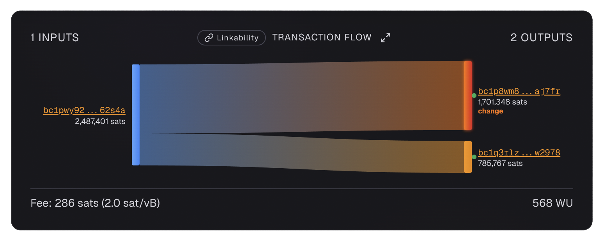

# Boltzmann Entropy

Boltzmann entropy is the most rigorous way to measure the privacy of a Bitcoin transaction. Named after physicist Ludwig Boltzmann, it quantifies exactly how much ambiguity exists about who sent what to whom.

This section will take you from zero knowledge to a deep understanding of how transaction privacy works mathematically. No prior knowledge is assumed - we will build everything from the ground up.

---

## Why Should You Care?

When you send Bitcoin, the transaction is recorded on the blockchain forever. Anyone can see:

- Which addresses sent bitcoin (the **inputs**)
- Which addresses received bitcoin (the **outputs**)
- How much was sent

What the blockchain does **not** tell you is: **which input funded which output?**

This is the fundamental question of Bitcoin privacy. If an observer can answer it with certainty, they know exactly where your money went. If they cannot, your privacy is preserved.

Boltzmann entropy measures **how many possible answers exist** to that question. More answers = more ambiguity = more privacy.

---

## The Big Idea in One Sentence

> **Boltzmann entropy counts the number of valid "stories" you could tell about where the money in a transaction came from and where it went.**

If there is only **one** valid story, everyone knows exactly what happened - zero privacy. If there are **millions** of valid stories, no one can tell which one is true - strong privacy.

---

## A Simple Example

Consider a straightforward transaction with one input and two outputs:

{ loading=lazy }

**Transaction ID:** [`639fc4b0...`](https://am-i.exposed/#tx=639fc4b0cace9370ed9e113b6e80a5765a27ebe601dd03ef350ada5b01bd2846)

- **Input:** 2,487,401 sats
- **Output 1:** 1,701,348 sats (change)
- **Output 2:** 785,767 sats (payment)

There is only **one** valid story: the input funded both outputs. **Entropy = 0 bits.**

Now compare to a 5-party Whirlpool CoinJoin:

{ loading=lazy }

- **5 inputs** of 5,000,000 sats each (excluding miner fees)
- **5 outputs** of 5,000,000 sats each

There are **1,496** valid stories. **Entropy = 10.55 bits.**

The observer faces 1,496 equally valid interpretations. They cannot tell which one is true.

---

## What You Will Learn

This section is broken into four pages, each building on the last:

-   :material-book-open-variant:{ .lg .middle } __What Is Entropy?__

    ---

    An intuitive introduction to the concept of transaction entropy, why it matters, and how it relates to privacy.

    [Start Here →](what-is-entropy.md)

-   :material-puzzle:{ .lg .middle } __Valid Interpretations__

    ---

    Learn what a "valid interpretation" is, how many-to-many mappings work, and walk through detailed examples.

    [Valid Interpretations →](valid-interpretations.md)

-   :material-matrix:{ .lg .middle } __Link Probability Matrix__

    ---

    Understand the Link Probability Matrix (LPM), how to read it, and what deterministic links mean.

    [Link Probability Matrix →](link-probability-matrix.md)

---

## Where Did This Come From?

The Boltzmann framework was created by **LaurentMT** around 2015 and published as a three-part series of gists that became the foundation for all modern Bitcoin transaction privacy analysis:

- **[Part 1: Entropy](https://gist.github.com/LaurentMT/e758767ca4038ac40aaf)** - Defines transaction entropy as E = log₂(N), where N is the number of valid interpretations
- **[Part 2: Linkability](https://gist.github.com/LaurentMT/d361bca6dc52868573a2)** - Defines the Link Probability Matrix and extends the framework to transaction chains
- **[Part 3: Attacks](https://gist.github.com/LaurentMT/e8644d5bc903f02613c6)** - Demonstrates CoinJoin attacks via LPM fingerprinting

The tool [am-i.exposed](https://am-i.exposed) implements these algorithms and uses them to analyze your transactions. The privacy analysis examples in this site all use Boltzmann entropy as their foundation.

---

## Key Terms You Will Encounter

| Term | Simple Definition |
|------|-------------------|
| **Input** | An address (UTXO) that is spending bitcoin |
| **Output** | An address that is receiving bitcoin |
| **Valid Interpretation** | A possible "story" about which inputs funded which outputs |
| **N** | The total number of valid interpretations |
| **Entropy (E)** | E = log₂(N) - a measure of ambiguity in bits |
| **Link Probability** | The probability that a specific input funded a specific output |
| **Link Probability Matrix (LPM)** | A table showing link probabilities for every input-output pair |
| **Deterministic Link** | A link that exists in ALL valid interpretations (probability = 100%) |

---

## The Most Important Thing to Remember

> **Higher entropy = more ambiguity = better privacy.**

A transaction with 0 bits of entropy has exactly one valid interpretation. Everyone knows exactly what happened.

A transaction with 10.55 bits of entropy (like a 5-party Whirlpool CoinJoin) has 1,496 valid interpretations. No one can tell which one is true.

The goal of privacy techniques like CoinJoin is to **maximize the number of valid interpretations** - to make the transaction look like it could have happened in many different ways.

---

## What Comes Next

Start with the introduction to build your intuition, then work through each page in order. Each page builds on the concepts from the previous one.

[What Is Entropy? →](what-is-entropy.md)
