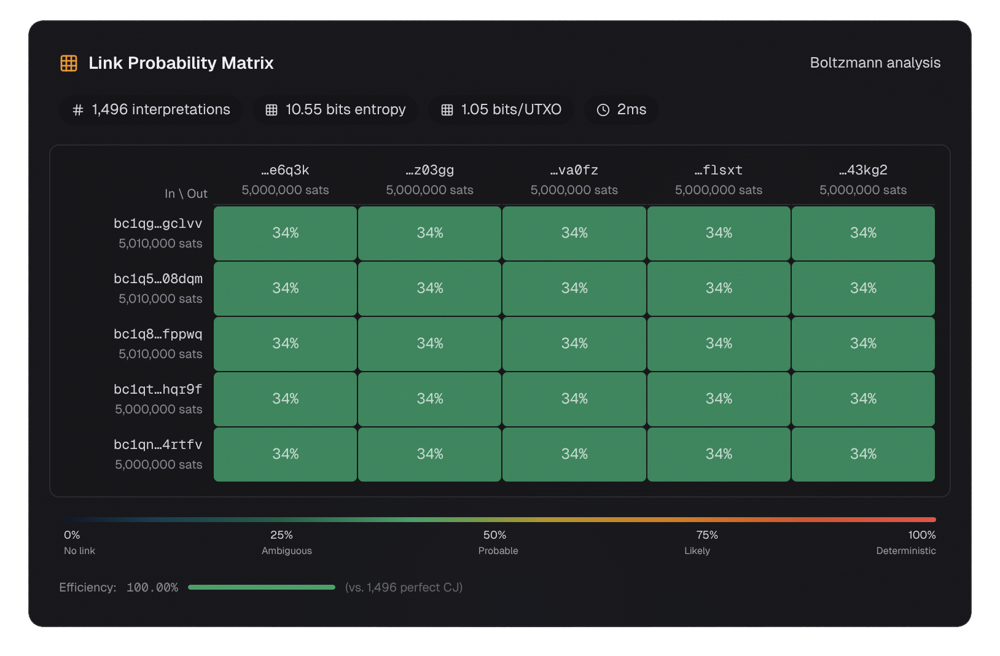

# Link Probability Matrix

The **[Link Probability Matrix](../glossary.md#link-probability-matrix) (LPM)** is the definitive tool for understanding transaction privacy. It answers the question:

> **What is the probability that input I funded output O?**

For every possible pair of input and output, the LPM gives you a probability. This is far more informative than a single entropy number.

---

## What Is the Link Probability Matrix?

The LPM is a table where:

- **Rows** = inputs (I1, I2, I3, ...)
- **Columns** = outputs (O1, O2, O3, ...)
- **Each cell** = the probability that the row's input funded the column's output

### The Formula

For each input-output pair (i, o), the [link probability](../glossary.md#link-probability) is:

$$LP(i, o, tx) = \frac{\text{# interpretations containing link}(i, o)}{\text{# total interpretations}}$$

In plain English: count how many valid interpretations include a link between input i and output o, then divide by the total number of interpretations.

---

## Reading a Link Probability Matrix

### The Whirlpool Example

Let us start with a 5-party Whirlpool CoinJoin:

{ loading=lazy }

This has 1,496 valid interpretations. The LPM looks like this:

{ loading=lazy }

| | O1 | O2 | O3 | O4 | O5 |
|---|---|---|---|---|---|
| **I1** | 0.342 | 0.342 | 0.342 | 0.342 | 0.342 |
| **I2** | 0.342 | 0.342 | 0.342 | 0.342 | 0.342 |
| **I3** | 0.342 | 0.342 | 0.342 | 0.342 | 0.342 |
| **I4** | 0.342 | 0.342 | 0.342 | 0.342 | 0.342 |
| **I5** | 0.342 | 0.342 | 0.342 | 0.342 | 0.342 |

Every cell is 0.342 (which is 511/1496). This is a **perfectly uniform** LPM.

### What This Means

- **No deterministic links** - no cell is 1.0
- **Maximum ambiguity** - every input could have funded every output with equal probability
- **34.2% per cell** - for any given input-output pair, there is a 34.2% chance they are linked

You might expect 20% (1 in 5) for each cell, but it is 34.2% because of many-to-many mappings. In many valid interpretations, one input funds multiple outputs simultaneously.

### The 2-Input, 2-Output Example

Now consider a simpler transaction:

{ loading=lazy }

**Transaction ID:** [`ce3d95a2...`](https://am-i.exposed/#tx=ce3d95a2ec0237898ed0e5961699408e67b19fc2fcce7dfdbf439cbc3b797921)

Looking at this transaction in isolation, there are 2 valid interpretations:

??? note "View the interpretations"

    ``` mermaid
    graph TD
        subgraph Interpretation 2
            I1_2[Input 1] --> BOTH_1[Both Outputs]
            I2_2[Input 2] --> BOTH_1
        end
        
        subgraph Interpretation 1
            I1_1[Input 1] --> O1_1[Output 1]
            I2_1[Input 2] --> O2_1[Output 2]
        end
    ```

However, when we incorporate blockchain context (the same address appears in both an input and an output), the [actual entropy](../glossary.md#actual-entropy) reveals **2 deterministic links**:

{ loading=lazy }

The LPM shows:
- **Input 1 → Output 1: 100%** (deterministic link)
- **Input 2 → Output 2: 100%** (deterministic link)
- **Input 1 → Output 2: 50%**
- **Input 2 → Output 1: 50%**

### Why Are There Deterministic Links?

In this transaction, the same address (`bc1qm...2gyxz`) appears as both an input and an output. This means:

1. The output to this address is certainly [change](../glossary.md#change)
2. This reveals which other output is the payment
3. The exact payment amount is now known

This is an example of **actual entropy being lower than [intrinsic entropy](../glossary.md#intrinsic-entropy)** - the blockchain context (address reuse) reduced the number of valid interpretations from 2 to effectively 1 for those specific links.

---

## Deterministic Links

When a link probability equals **1.0 (100%)**, that link exists in **all** valid interpretations. No matter how you interpret the transaction, this specific input-output connection is certain.

These are called [deterministic links](../glossary.md#deterministic-link). They represent a complete privacy failure for that specific pair.

### Why Deterministic Links Matter

If an observer can identify a deterministic link, they know with certainty:

- Which input funded which output
- The exact amount that was transferred
- The remaining balance (change output)

This is the essence of the **CoinJoin Sudoku** attack: even in a CoinJoin, some participants may have deterministic links, meaning the CoinJoin provides zero privacy for them.

### How to Detect Deterministic Links

Look for cells with probability 1.0 in the LPM. If any exist, those links are deterministic.

---

## Extending the LPM Beyond Single Transactions

LaurentMT's framework extends the LPM concept to:

### Transaction Sequences

For a sequence of transactions [TX₁, TX₂, ..., TXⱼ], the LPM can be computed from the inputs of TX₁ to the outputs of TXⱼ. This traces fund flows across multiple hops.

### Transaction Trees

For a tree of transactions (where outputs of one transaction become inputs of the next), the LPM can be computed from the root inputs to the leaf outputs.

### Transaction Graphs

For a connected graph of transactions, the LPM can be computed from all inputs at level 1 to all outputs at level J.

### Why This Matters

This is how [chain analysis](../glossary.md#chain-analysis) firms trace bitcoin through many hops. They compute the LPM for the entire transaction graph, not just individual transactions.

The good news: **CoinJoin breaks this**. After a CoinJoin, the LPM for subsequent transactions becomes much more ambiguous because the CoinJoin's internal ambiguity propagates forward.

---

## Using the LPM to Evaluate Privacy

### Good Privacy Indicators

- **No deterministic links** (no cells at 1.0)
- **Uniform probabilities** (all cells similar)
- **High entropy** (many valid interpretations)
- **Low maximum link probability** (no cell stands out)

### Bad Privacy Indicators

- **Deterministic links exist** (cells at 1.0)
- **Skewed probabilities** (some cells much higher than others)
- **Low entropy** (few valid interpretations)
- **High maximum link probability** (one cell dominates)

### The Homogeneity Principle

Beyond individual cell values, the **homogeneity** of the LPM matters. A transaction where all cells are approximately equal (like the Whirlpool example) provides better privacy than one where some cells are much higher than others, even if both have the same entropy.

This is because an adversary can use the higher-probability cells to make educated guesses, even if they cannot be certain.

---

## Key Takeaways

1. **The LPM answers "what is the probability that input I funded output O?"** for every pair
2. **Rows are inputs, columns are outputs**
3. **Deterministic links (probability = 1.0) are privacy failures** - they exist in all interpretations
4. **Uniform LPMs = good privacy** - no cell stands out
5. **The LPM extends to transaction chains and graphs** - this is how multi-hop tracing works
6. **Actual entropy can be lower than intrinsic entropy** - blockchain context reduces ambiguity

---

## What Comes Next

Now that you understand the LPM, you have a complete understanding of Boltzmann entropy, valid interpretations, and the Link Probability Matrix. This is the mathematical foundation of Bitcoin transaction privacy.

The [Privacy Analysis](../analysis/index.md) section walks through real transaction examples using these concepts, showing you exactly what chain analysts can figure out about your transactions.

[Privacy Analysis →](../analysis/index.md)

---

## References

- [LaurentMT, "Bitcoin Transactions & Privacy (Part 2: Linkability)"](https://gist.github.com/LaurentMT/d361bca6dc52868573a2)
- [LaurentMT, "Bitcoin Transactions & Privacy (Part 3: Attacks)"](https://gist.github.com/LaurentMT/e8644d5bc903f02613c6)
- [am-i.exposed Boltzmann WASM ADR](https://github.com/Copexit/am-i-exposed/blob/main/docs/adr-boltzmann-wasm.md)
