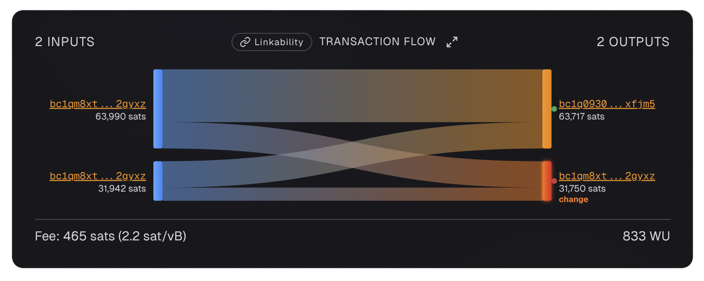
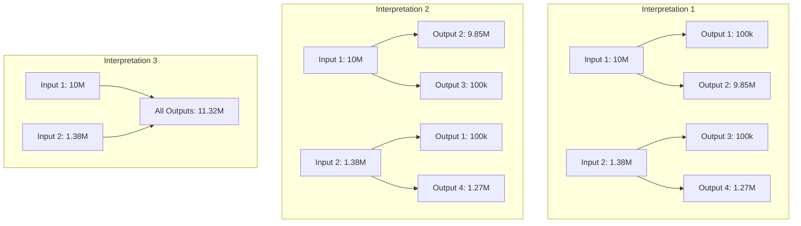
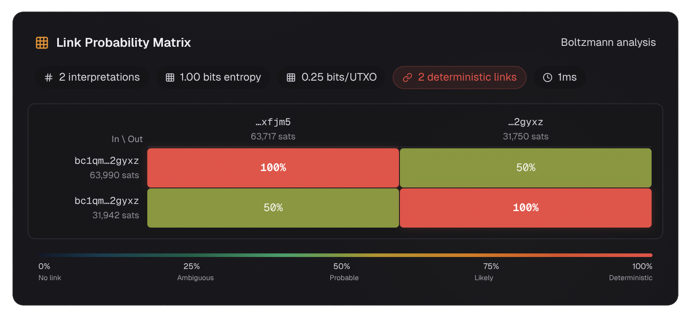

# Valid Interpretations

The concept of a **valid interpretation** is the foundation of [Boltzmann entropy](index.md). Understanding it unlocks everything else about transaction privacy.

---

## What Is a Valid Interpretation?

A valid interpretation is a **complete story** about which inputs funded which outputs in a transaction.

More precisely, it is a **partition** of all inputs and all outputs into groups, where each group's input sum equals its output sum (within the transaction fee tolerance).

!!! warning "Important: Interpretation Is About Structure, Not Semantics"

    A common point of confusion: people think "I do not know which output is the payment and which is the change, so there must be 2 interpretations."

    **This is not how Boltzmann entropy works.** An interpretation is purely about **mathematical grouping** - can the input values be combined to match the output values? It does not matter which output is the payment or which is the change. Those are semantic questions that are separate from the raw entropy calculation based on the .

    **Entropy measures structural ambiguity, not contextual ambiguity.**

    Contextual ambiguity is very important, but in order to understand from the perspective of boltzmann entropy you must put that aside for now.

Let us unpack that definition step by step.

---

## The Building Blocks

### Inputs and Outputs

Every Bitcoin transaction has:

- **Inputs**: The [UTXOs](../glossary.md#utxo) being spent (where the money comes from)
- **Outputs**: The new UTXOs being created (where the money goes)

Consider this 2-input, 2-output transaction:

{ loading=lazy }

**Transaction ID:** [`ce3d95a2...`](https://am-i.exposed/#tx=ce3d95a2ec0237898ed0e5961699408e67b19fc2fcce7dfdbf439cbc3b797921)

```
Input 1:  63,990 sats
Input 2:  31,942 sats

Output 1: 63,717 sats
Output 2: 31,750 sats

Fee: 465 sats
```

Total inputs: 95,932 sats
Total outputs: 95,467 sats
Difference (fee): 465 sats ✓

### The Key Constraint

For an interpretation to be **valid**, every group of inputs and outputs must satisfy a simple rule: the total value of inputs in the group minus the total value of outputs in the group must equal some portion of the transaction fee (and cannot be negative - you cannot create bitcoin).

In other words, each group must "balance" within the fee tolerance.

---

## One-to-One vs. Many-to-Many Mappings

### The Intuitive (But Incomplete) View

Most people naturally think of transactions as **one-to-one mappings**:

- Input 1 funded Output 1
- Input 2 funded Output 2

This is how we think about handing over specific banknotes: I give you a $20 note for a $20 item. That note funded that item.

But in Bitcoin, the reality is more flexible. A single input can fund **multiple outputs**, and multiple inputs can combine to fund **a single output**.

### The Many-to-Many Reality

A valid interpretation is a **many-to-many mapping**. Consider the 2-input, 2-output transaction above:

**Interpretation 1:**
- Input 1 (63,990) funds Output 1 (63,717), leaving 273 sats for fees
- Input 2 (31,942) funds Output 2 (31,750), leaving 192 sats for fees

Total fees: 273 + 192 = 465 ✓

**Interpretation 2:**
- Input 1 + Input 2 (95,932 combined) fund both Output 1 + Output 2 (95,467), leaving 465 sats for fees

Total fees: 465 ✓

This transaction has **2 valid interpretations**, so its [intrinsic entropy](../glossary.md#intrinsic-entropy) is:

$$E = \log_2(2) = 1.00 \text{ bit}$$

---

## A More Complex Example

Consider a transaction with the following structure:

```
Input 1:  10,000,000 sats
Input 2:   1,380,000 sats

Output 1:    100,000 sats
Output 2:  9,850,000 sats
Output 3:    100,000 sats
Output 4:  1,270,000 sats

Fee: 60,000 sats
```

Total inputs: 11,380,000 sats
Total outputs: 11,320,000 sats
Difference (fee): 60,000 sats ✓

Let us find all valid interpretations. The diagram below shows how the three interpretations group inputs and outputs:



### Interpretation 1:

- Input 1 (10M) funds Output 1 (100k) + Output 2 (9.85M) = 9.95M, leaving 50k for fees
- Input 2 (1.38M) funds Output 3 (100k) + Output 4 (1.27M) = 1.37M, leaving 10k for fees

Total fees: 50k + 10k = 60k ✓

### Interpretation 2:

- Input 1 (10M) funds Output 2 (9.85M) + Output 3 (100k) = 9.95M, leaving 50k for fees
- Input 2 (1.38M) funds Output 1 (100k) + Output 4 (1.27M) = 1.37M, leaving 10k for fees

Total fees: 50k + 10k = 60k ✓

### Interpretation 3:

- Input 1 + Input 2 (11.38M combined) fund ALL outputs (11.32M), leaving 60k for fees

Total fees: 60k ✓

This transaction has **3 valid interpretations**, so its entropy is:

$$E = \log_2(3) = 1.585 \text{ bits}$$

This is the same structure as the original DarkWallet CoinJoin that LaurentMT used in his 2015 paper.

---

## Why Many-to-Many Matters

This is the critical insight that many explanations miss: **a single input can fund multiple outputs in the same interpretation**.

In Interpretation 1 above, Input 1 funds both Output 1 AND Output 2. This is not two separate transactions - it is one interpretation of how the single transaction's funds flowed.

This is why the number of valid interpretations can be much larger than you might expect. For a 5-party CoinJoin, you might naively think there are 5! = 120 interpretations (one for each permutation of which input maps to which output). But the actual number is **1,496** - more than 12 times larger - because many-to-many mappings are also valid.

---

## Deterministic Links

Even when there are multiple valid interpretations, some input-output links may exist in **all** of them. These are called [deterministic links](../glossary.md#deterministic-link).

### Intrinsic vs. Actual Entropy

Looking at the 2-input, 2-output transaction above in isolation (its **intrinsic entropy**), there are no deterministic links - no single input-output pair appears in all interpretations:

| Link | Interpretation 1 | Interpretation 2 | In Both? |
|------|-----------------|-----------------|----------|
| I1 → O1 | Yes | No | No |
| I1 → O2 | No | Yes | No |
| I2 → O1 | No | Yes | No |
| I2 → O2 | Yes | No | No |

However, when we look at the **actual entropy** (incorporating blockchain context), the picture changes. In this specific transaction, [am-i.exposed](https://am-i.exposed) uncovered **2 deterministic links** because the same address appears in both an input and an output.

{ loading=lazy }

When an address that funded the transaction also receives an output, that output is certainly [change](../glossary.md#change). This reveals which other outputs are payments and the exact payment amount. This is an example of **actual entropy being lower than intrinsic entropy** - the blockchain context reduced the number of valid interpretations.

This is the essence of the **CoinJoin Sudoku** attack described by Kristov Atlas: even in a CoinJoin transaction, some participants may have deterministic links, meaning the CoinJoin provides zero privacy for them specifically.

---

## Key Takeaways

1. **A valid interpretation is a partition** of all inputs and outputs into groups where each group balances
2. **Many-to-many mappings are real** - one input can fund multiple outputs in the same interpretation
3. **This is why N can be much larger than n!** - the partition model counts many-to-many, the permutation model only counts one-to-one
4. **Deterministic links exist in ALL interpretations** - they are privacy leaks even in CoinJoins
5. **Actual entropy can be lower than intrinsic entropy** - blockchain context (like address reuse) reduces ambiguity

---

## What Comes Next

Now that you understand valid interpretations, the next page explains the **[Link Probability Matrix](link-probability-matrix.md)** - how to read it, what it tells you, and what deterministic links mean for your privacy.

[Link Probability Matrix →](link-probability-matrix.md)

---

## References

- [LaurentMT, "Bitcoin Transactions & Privacy (Part 1: Entropy)"](https://gist.github.com/LaurentMT/e758767ca4038ac40aaf)
- [LaurentMT, "Bitcoin Transactions & Privacy (Part 2: Linkability)"](https://gist.github.com/LaurentMT/d361bca6dc52868573a2)
- [am-i.exposed Boltzmann WASM ADR](https://github.com/Copexit/am-i-exposed/blob/main/docs/adr-boltzmann-wasm.md)
- [Kristov Atlas, "CoinJoin Sudoku"](http://www.coinjoinsudoku.com/)
