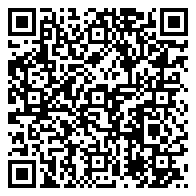
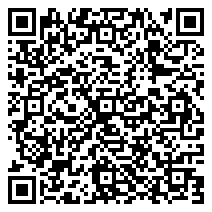
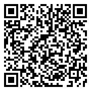
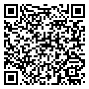

# Support BitcoinPrivacy.wiki

**BitcoinPrivacy.wiki** is a free and open-source informational resource dedicated to helping people understand Bitcoin privacy

If you’ve found this resource helpful, please consider supporting the project with a small tip.

---

## PayNym: [+headymouth97](https://paynym.rs/+headymouth97)

<figure markdown="span">
  { loading=lazy width="250" }
  <br>
  [Open in Wallet](bitcoin:PM8TJVSpkgKU9BX95eCZY9JXGJSJWf55A6Hx5TWk9aNtRZhxoMcdxRFax52iku4QDR8sCBfYN8GgF8XLzEDNpc7cyHwrnbUYQoWAYzxMJsadW9FZa6Po?title=+headymouth97){ .md-button .md-button--primary }
  <br><br>
  ```
  PM8TJVSpkgKU9BX95eCZY9JXGJSJWf55A6Hx5TWk9aNtRZhxoMcdxRFax52iku4QDR8sCBfYN8GgF8XLzEDNpc7cyHwrnbUYQoWAYzxMJsadW9FZa6Po
  ```
</figure>

---

## Silent Payments

<figure markdown="span">
  { loading=lazy width="250" }
  <br>
  [Open in Wallet](bitcoin:sp1qq2qp5j9gvjrzhaqycqwalppnedy40asf8g9arl2mumphmaxlce79xqs4ld60pkzj7p2p8k6f9d2ex9g08snyargd6h9f8ltgl289x4mg0guznl3s?){ .md-button .md-button--primary }
  <br><br>
  ```
  sp1qq2qp5j9gvjrzhaqycqwalppnedy40asf8g9arl2mumphmaxlce79xqs4ld60pkzj7p2p8k6f9d2ex9g08snyargd6h9f8ltgl289x4mg0guznl3s
  ```
</figure>

---

## Monero

<figure markdown="span">
  { loading=lazy width="250" }
  <br>
  [Open in Wallet](monero:82pQ5uDDs2Jitto1XneQYaGCBQGn79kAwC2vHYrrVUMEUw31HTthNgPdBCYCpbDzJi1aaKhvZfWin77HqB41gQuBSajZvjY){ .md-button .md-button--primary }
  <br><br>
  ```
  82pQ5uDDs2Jitto1XneQYaGCBQGn79kAwC2vHYrrVUMEUw31HTthNgPdBCYCpbDzJi1aaKhvZfWin77HqB41gQuBSajZvjY
  ```
</figure>

---

## Lightning

<figure markdown="span">
  { loading=lazy width="250" }
  <br>
  [Open in Wallet](lightning:lnurl1dp68gurn8ghj7cmpddjjucmpwd5z7tnhv4kxctttdehhwm30d3h82unvwqhhv6tzwfskuaq5g3umf){ .md-button .md-button--primary }
  <br><br>
  ```
  vibrant@cake.cash
  ```
</figure>

---
Thank you for your support