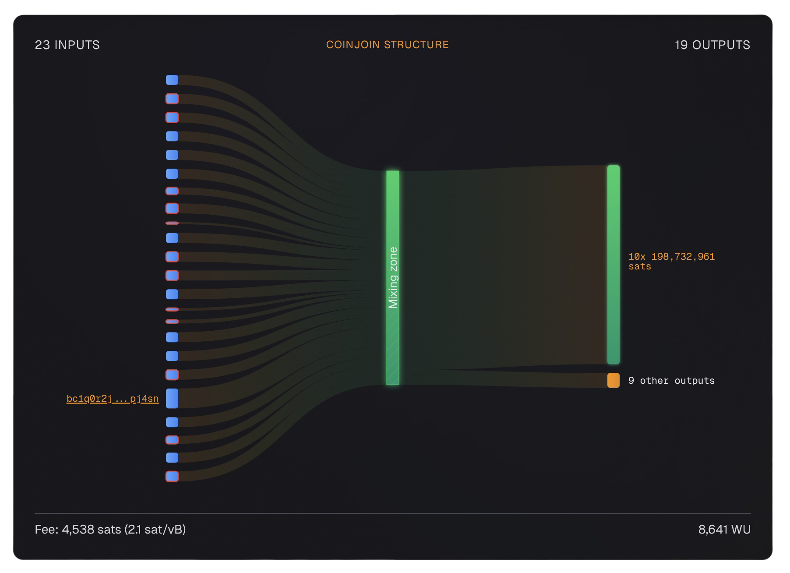

# JoinMarket

JoinMarket is a peer-to-peer marketplace for CoinJoin on Bitcoin. Unlike other CoinJoin implementations that use a coordinator, JoinMarket uses a maker/taker model where participants earn fees for providing liquidity.

!!! info "Other CoinJoin Implementations"

    JoinMarket is one of several CoinJoin implementations. Others include [Whirlpool](whirlpool.md) (5-party, fixed denominations) and [Wasabi Wallet](wasabi.md) (WabiSabi protocol, 50-150 participants). Each has different trade-offs in terms of privacy, convenience, and censorship resistance.

---

## What Is JoinMarket?

JoinMarket is a decentralized CoinJoin protocol where:

- **Makers** advertise their willingness to participate in CoinJoins and earn fees
- **Takers** initiate CoinJoins and pay fees to the makers

This creates a free market for CoinJoin liquidity, where anyone can earn bitcoin by helping others mix.

!!! tip "The Key Difference"

    Unlike Whirlpool or Wasabi, JoinMarket has no central coordinator. Makers and find each other through a peer-to-peer network, making it more resistant to censorship and shutdown.

---

## JoinMarket Transaction Example

The image below shows a JoinMarket CoinJoin transaction as analyzed by [am-i.exposed](../../advanced/check-privacy.md). Notice the flexible denominations (10 equal 198,732,961 sat outpus) and 9 change outputs that distinguishes JoinMarket from other CoinJoin implementations.

{ loading=lazy }

---

## How JoinMarket Works

=== "Step 1: Become a Maker or Taker"

    **As a Maker:** You run a JoinMarket bot that advertises your availability to participate in CoinJoins. You earn fees when others use your liquidity.

    **As a Taker:** You initiate a CoinJoin and pay fees to the makers who participate.

=== "Step 2: Find Counterparties"

    Makers and takers find each other through the JoinMarket network. This happens over IRC or direct connections.

=== "Step 3: Execute the CoinJoin"

    The CoinJoin is constructed with inputs from multiple parties. Each party signs only their own inputs.

=== "Step 4: Broadcast"

    Once all signatures are collected, the transaction is broadcast to the Bitcoin network.

---

## JoinMarket Denominations

Unlike Whirlpool, JoinMarket does not use fixed denominations. Takers can mix any amount, and makers can set their own minimum and maximum amounts.

This flexibility is both a strength and a weakness:

**Strengths:**
- Mix any amount
- No need to split into fixed denominations
- More efficient for large amounts

**Weaknesses:**
- Outputs may not be as uniform
- Requires more careful analysis to ensure privacy

---

## Why You Must Use the [Tumbler](../../glossary.md#tumbler)

!!! danger "Single CoinJoins Are Not Enough"

    **Do not use `sendpayment` for serious privacy.** A single JoinMarket CoinJoin can be partially or fully unmixed by blockchain analysis. You must use the [tumbler](../../glossary.md#tumbler) script which performs multiple consecutive CoinJoins to achieve meaningful privacy.

### The Unmixing Problem

In September 2016, a researcher published a tool called "jm_unmixer" on Bitcointalk that demonstrated a serious weakness in single JoinMarket CoinJoins. The tool was able to unmix approximately 40-54% of all JoinMarket transactions, with about 1 in 4 being fully unmixed.

[[Source: Bitcointalk Thread](https://bitcointalk.org/index.php?topic=1609980.00)]

### How the Attack Works

To understand why this works, you need to understand how JoinMarket transactions are structured:

- **[Takers](../../glossary.md#taker)** are the people who want to mix their coins. They pay fees.
- **[Makers](../../glossary.md#maker)** are the people providing liquidity. They earn fees.

In a JoinMarket transaction, you can identify which inputs and outputs belong to makers versus takers by matching the amounts. The CoinJoin amount (the amount being mixed) appears as equal outputs for all participants. The change outputs are different for each participant.

Here is the key insight: **makers often reuse their outputs**. When a maker participates in one CoinJoin and then spends their output in another CoinJoin, it creates a link between the two transactions. An analyst can follow this link and identify which outputs belong to makers (who are earning fees) versus takers (who are paying for privacy).

Once the analyst knows which outputs belong to makers, they can effectively "unmix" the transaction - identifying which output belongs to the taker. This defeats the entire purpose of using CoinJoin.

### Why the [Tumbler](../../glossary.md#tumbler) Solves This

The [tumbler](../../glossary.md#tumbler) script in JoinMarket addresses this vulnerability by performing **multiple consecutive CoinJoins** with several important features:

1. **Multiple Rounds**: Instead of one CoinJoin, the tumbler performs several in sequence. Each round adds another layer of ambiguity.

2. **Random Amounts**: Each CoinJoin uses a different, randomly chosen amount. This breaks the amount-matching algorithm that the unmixing tool relies on.

3. **Random Timing**: The tumbler waits random amounts of time between rounds. This prevents timing analysis from linking the rounds together.

4. **Multiple Destination Addresses**: The tumbler splits your coins across multiple addresses, making it harder to track where your coins ended up.

5. **Role Mixing**: By participating in multiple rounds, the distinction between maker and taker roles becomes blurred over time.

### The Bottom Line

JoinMarket's own developers have acknowledged this vulnerability. As waxwing (a JoinMarket developer) stated in the original thread:

> "Of course; that's why the tumbler script exists. A single coinjoin serves only to confuse automated wallet closure analysis, and to generally improve the health of Bitcoin's privacy... Whenever possible we have tried to make this clear."

**Always use the [tumbler](../../glossary.md#tumbler) for serious privacy.** Single CoinJoins provide a false sense of security.

---

## JoinMarket Fees

Makers set their own fees. Typical fees are:

| Amount | Typical Fee |
|--------|-------------|
| Small (< 0.01 BTC) | 0.1-0.5% |
| Medium (0.01-0.1 BTC) | 0.05-0.2% |
| Large (> 0.1 BTC) | 0.01-0.1% |

!!! tip "Earn Bitcoin as a Maker"

    If you run a maker bot, you can earn bitcoin by providing liquidity for other people's CoinJoins. This is a great way to earn bitcoin while helping others achieve privacy.

---

## JoinMarket Best Practices

-   :material-server:{ .lg .middle } __Run Your Own Maker Bot__

    ---

    This earns you bitcoin and helps the JoinMarket network stay healthy.

-   :material-incognito:{ .lg .middle } __Use Tor__

    ---

    JoinMarket supports Tor natively. Use it to hide your IP address.

-   :material-shuffle:{ .lg .middle } __Do Multiple Rounds__

    ---

    Like any CoinJoin, multiple rounds increase your anonymity set.

-   :material-hand-back-right-off:{ .lg .middle } __Never Spend Post-Mix Together__

    ---

    Each post-mix output should be spent independently.

-   :material-shield-check:{ .lg .middle } __Use a Dedicated Wallet__

    ---

    Do not mix your JoinMarket wallet with your main wallet.

-   :material-clock:{ .lg .middle } __Be Patient__

    ---

    Finding counterparties can take time. Be patient and let the network work.

---

## JoinMarket vs Other CoinJoin Implementations

| Feature | JoinMarket | Whirlpool | Wasabi |
|---------|-----------|-----------|--------|
| **Coordinator** | None (P2P) | Centralized | Centralized |
| **Denominations** | Flexible | Fixed | Flexible |
| **Fees** | Earn as maker | Pay coordinator | Pay coordinator |
| **Complexity** | High | Low | Medium |
| **Censorship Resistance** | High | Low | Medium |
| **Anonymity Set** | Variable | 5 | 50-150 |

---

## Common JoinMarket Mistakes

=== "Not Running a Maker Bot"

    If you only use JoinMarket as a taker, you are not helping the network. Consider running a maker bot to earn fees and help others.

=== "Spending Post-Mix UTXOs Together"

    Same as any CoinJoin - never spend post-mix outputs together.

=== "Not Using Tor"

    Without Tor, your IP is exposed to other participants.

=== "Impatience"

    JoinMarket can take longer than other CoinJoin implementations. Be patient and let the network find counterparties.

---

## Post-Mix Management

Like Whirlpool, JoinMarket produces post-mix UTXOs that require careful handling. The principles are the same across all CoinJoin implementations:

- **Never spend post-mix UTXOs together** - Each output should be spent independently
- **Never mix post-mix with premix** - Keep mixed and unmixed coins separate
- **Label your UTXOs** - Track which coins have been through CoinJoins
- **Avoid consolidation** - Combining post-mix UTXOs reduces your anonymity set

For detailed guidance on managing post-mix coins and handling doxxic change, see the [Whirlpool page](whirlpool.md#spending-the-doxxic-change) which covers these topics in depth.

!!! info "Post-Mix Best Practices"

    The post-mix management principles from [Whirlpool](whirlpool.md#how-to-manage-postmix) apply equally to JoinMarket. Never merge mixed and unmixed UTXOs, prefer spending from post-mix directly, don't reuse addresses, and be cautious with script types and consolidations.
