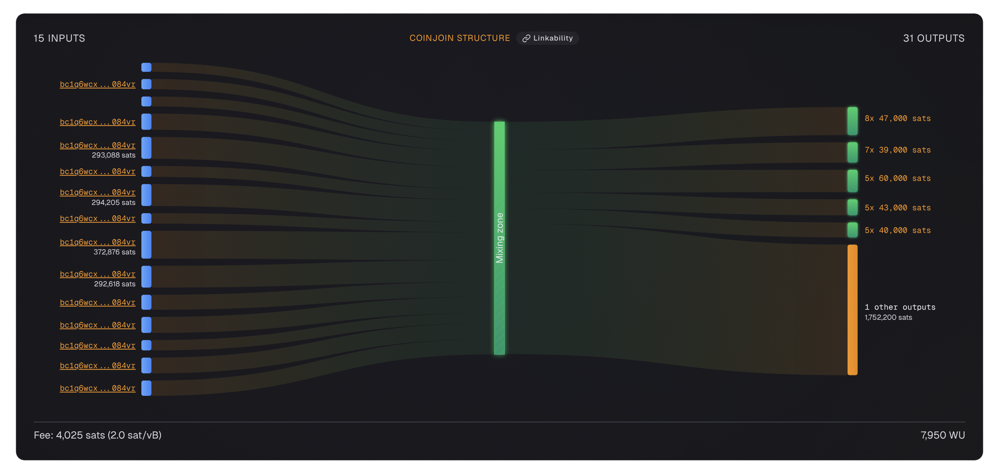

# WabiSabi

Wasabi Wallet is a privacy-focused Bitcoin wallet for desktop that implements CoinJoin using the WabiSabi protocol.

!!! info "Other CoinJoin Implementations"

    Wasabi is one of several CoinJoin implementations. Others include [Whirlpool](whirlpool.md) (fixed denominations, strict separation) and [JoinMarket](joinmarket.md) (decentralized, maker-taker model). Each has different trade-offs in terms of privacy, convenience, and censorship resistance.

---

## What Is Wasabi Wallet?

Wasabi Wallet is an open-source, non-custodial Bitcoin wallet that focuses on privacy through CoinJoin. It uses the WabiSabi protocol, which allows participants to mix any amount of bitcoin — not just fixed denominations like [Whirlpool](whirlpool.md).

!!! tip "WabiSabi Protocol"

    WabiSabi is a CoinJoin protocol that uses cryptographic credentials to allow flexible output amounts. This makes it more flexible than fixed-denomination CoinJoins but requires more careful analysis to understand the privacy gained.

---

## Wasabi 1.0 vs WabiSabi (Wasabi 2.0)

Wasabi has gone through a major evolution. Understanding the difference between the two versions helps explain why WabiSabi was created.

### Wasabi 1.0: Large Single Rounds

The original Wasabi used very large CoinJoin transactions with dozens of participants all joining a single round. Everyone put in their coins, and everyone got one mixed output back. The change from each participant was returned as a single output directly linked to their input — creating obvious [deterministic links](../../glossary.md#deterministic-link).

### WabiSabi: Multiple Cycles with Change Subdivision

WabiSabi (Wasabi 2.0) moved closer to the [Whirlpool](whirlpool.md) model by allowing users to chain multiple successive cycles. More importantly, it changed how change is handled — instead of returning change directly to the sender, WabiSabi breaks change into smaller equal pieces and distributes them among all participants.

??? example "See How Change Subdivision Works"

    Imagine Maya wants to mix 85,000 [sats](../../glossary.md#satoshi-sat) and Zara wants to mix 130,000 sats. The CoinJoin round produces mixed outputs of 70,000 sats for each participant.

    **In Wasabi 1.0:**
    - Maya would get 15,000 sats back as change
    - Zara would get 60,000 sats back as change

    An observer could easily say: "That 15,000-sat output must belong to Maya, and that 60,000-sat output must belong to Zara." The link is obvious.

    **In WabiSabi 2.0:**
    The total leftover change (75,000 sats) is broken into five equal outputs of 15,000 sats each. These five outputs are then shared among all participants. Now there is no single change output that points back to Maya or Zara — the change is mixed up just like the main coins.

    This approach makes it much harder for chain analysts to figure out who owns which change output.

---

## WabiSabi Transaction Example

The image below shows a WabiSabi (Wasabi Wallet) CoinJoin transaction as visualised by [am-i.exposed](https://am-i.exposed). Notice the large number of inputs and various sets of variable denomination outputs that distinguish WabiSabi from fixed-denomination CoinJoins like Whirlpool.

{ loading=lazy }

---

## Risks of Change Subdivision

While WabiSabi's change subdivision is a big improvement over Wasabi 1.0, it is not perfect. There are some weaknesses you should know about.

??? warning "Large Inputs Can Still Be Traced"

    If you contribute a [UTXO](../../glossary.md#utxo) that is much larger than what other participants are mixing, you will inevitably end up with change amounts that can still be linked back to your input. The math has to work out — if you put in a huge amount and the mixed outputs are small, the leftover change has to go somewhere. Even with subdivision, a large enough difference can leave a trail.

??? warning "Too Many Denominations Can Reduce Privacy"

    WabiSabi tries to create multiple equal-sized change outputs to confuse observers. But sometimes, creating too many different denominations can actually make things worse. When there are unusual or rare output amounts, those outputs stand out and become easier to identify. This can shrink your effective [anonymity set](../../glossary.md#anonymity-set) instead of growing it.

??? danger "The Dust UTXO Problem"

    Breaking change into many small pieces creates a lot of low-value UTXOs. Some of these can become so small that they turn into "dust" — amounts that cost more in mining fees to spend than they are worth.

    When users eventually try to consolidate these dust UTXOs together, the [Common Input Ownership Heuristic](../../glossary.md#common-input-ownership-heuristic) kicks in. This heuristic assumes that all inputs in a transaction belong to the same person. By combining dust outputs, you are essentially telling the blockchain: "Yes, all these small pieces belong to me." This can reduce or even cancel out the privacy benefits you gained from the original CoinJoin.

---

## No Pre-Mix / Post-Mix Separation

!!! warning "Important Difference from Whirlpool"

    Unlike Whirlpool which strictly separates pre-mix and post-mix UTXOs using the [ZeroLink](../../glossary.md#zerolink) protocol, WabiSabi does not maintain this strict segregation. There have also been problems of address reuse by some Wasabi users, which is very detrimental to privacy.

Whirlpool enforces separation through four separate wallet accounts: **Deposit**, **Premix**, **Postmix**, and **Bad Bank**. This makes it nearly impossible to accidentally mix clean coins with dirty ones.

WabiSabi puts everything in the same wallet. The responsibility for keeping mixed and unmixed coins separate falls entirely on you. If you accidentally select an unmixed UTXO alongside a mixed one in the same transaction, you instantly link your clean coins to your dirty history — destroying all the privacy you worked to achieve.

---

## Wasabi Fees

WabiSabi charges a coordination fee for each CoinJoin round. The fee depends on the coordinator you connect to, but the standard rate set by zkSNACKs was:

| UTXO Size | Coordinator Fee |
|-----------|----------------|
| Above 0.01 BTC | 0.3% |
| Below 0.01 BTC | Free (no coordinator fee) |

Even when the coordinator fee is waived, you still need to pay mining fees for the transaction to be confirmed on the Bitcoin network. This applies to all rounds, including remixes.

### Comparison to Whirlpool

Whirlpool works differently. It charges a fixed entry fee when you first enter a pool, and all remixes after that are completely free — no extra coordinator fees, no extra mining fees. Wasabi's percentage-based model means you pay more when you mix larger amounts, while Whirlpool's flat fee stays the same regardless of how much you mix or how many rounds you do.

---

## zkSNACKs Coordinator Discontinuation

!!! danger "Major Change for Wasabi Users"

    On June 1, 2024, zkSNACKs — the company that built and maintained Wasabi Wallet — shut down their main CoinJoin coordinator service.

A coordinator is the server that organizes CoinJoin rounds: it finds participants, matches inputs, and constructs the final transaction. Without a coordinator, Wasabi Wallet cannot run CoinJoin rounds on its own.

### What This Means for You

Users must now connect to new, independent coordinators run by other parties. This introduces some risks:

??? warning "Lower Liquidity"

    New coordinators may not have as many participants. Fewer people in a round means a smaller [anonymity set](../../glossary.md#anonymity-set), which means less privacy for everyone involved.

??? danger "Malicious Coordinators"

    There is a risk of connecting to a coordinator run by someone who wants to deanonymize users. A dishonest coordinator could try to collect information about participants and their inputs.

Always make sure you are connecting to a coordinator you trust, and use [Tor](../../glossary.md#tor) to protect your IP address.

---

## The Filtering Controversy

!!! quote "A Contradiction in Privacy"

    zkSNACKs faced significant criticism for partnering with a blockchain analysis company to filter participants in their CoinJoin rounds. The goal was to prevent criminals from using Wasabi Wallet.

Here is why this is problematic:

### It Undermines the Whole Point

Wasabi is a privacy tool. Users pay coordinator fees to a service whose entire job is to protect their financial privacy. Then that service uses those fees to fund a company whose entire job is to destroy financial privacy. This is a contradiction that many in the Bitcoin community found unacceptable.

### It Goes Against Bitcoin's Philosophy

Bitcoin was created as an open, permissionless, and uncensored financial system. Filtering who can and cannot participate in a CoinJoin goes against this core principle. If a coordinator can block certain users today, what stops them from blocking other users tomorrow for different reasons?

### The Code Is Already Out There

Another major concern is that the filtering code has already been published, utilised in production by zkSNACKs and is publicly available. There is no way for users to verify whether an independent coordinator is running a version of this filtering code or not, since you cannot know exactly what software they are running on their servers. This means the filtering capability could be silently adopted by any coordinator without users ever knowing.

---

## Wasabi Best Practices

-   :material-shuffle:{ .lg .middle } __Do Multiple Rounds__

    ---

    Like any CoinJoin, multiple rounds increase your anonymity set exponentially.

-   :material-incognito:{ .lg .middle } __Use Tor__

    ---

    Wasabi has built-in Tor support. Enable it in settings.

-   :material-hand-back-right-off:{ .lg .middle } __Never Spend Post-Mix Together__

    ---

    Each post-mix output should be spent independently to preserve privacy.

-   :material-shield-check:{ .lg .middle } __Verify the Download__

    ---

    Always verify the Wasabi download signature before installing.

-   :material-label:{ .lg .middle } __Label Your UTXOs__

    ---

    Keep track of premix and post-mix UTXOs. Never mix them.

-   :material-clock:{ .lg .middle } __Be Patient__

    ---

    Wasabi rounds can take time. Let the network find enough participants.

---

## Common Wasabi Mistakes

=== "Spending Post-Mix UTXOs Together"

    Same as any CoinJoin — never spend post-mix outputs together.

=== "Not Using Tor"

    Without Tor, your IP is exposed to the coordinator and other participants.

=== "Doing Only One Round"

    One round gives limited privacy. Do multiple rounds for meaningful privacy.

=== "Consolidating Dust UTXOs"

    Combining many small post-mix UTXOs triggers the Common Input Ownership Heuristic and can undo your privacy gains.

=== "Mixing Pre-Mix and Post-Mix UTXOs"

    Since WabiSabi does not enforce separation between mixed and unmixed coins, it is easy to accidentally combine them in a single transaction. Always use [coin control](../../glossary.md#coin-control) to carefully select only the UTXOs you intend to spend.

---

## Post-Mix Management

Like Whirlpool, Wasabi produces post-mix UTXOs that require careful handling. The principles are the same across all CoinJoin implementations:

- **Never spend post-mix UTXOs together** — Each output should be spent independently
- **Never mix post-mix with premix** — Keep mixed and unmixed coins separate
- **Label your UTXOs** — Track which coins have been through CoinJoins
- **Avoid consolidation** — Combining post-mix UTXOs reduces your anonymity set

For detailed guidance on managing post-mix coins and handling doxxic change, see the [Whirlpool page](whirlpool.md#spending-the-doxxic-change) which covers these topics in depth.

!!! info "Post-Mix Best Practices"

    The post-mix management principles from [Whirlpool](whirlpool.md#how-to-manage-postmix) apply equally to Wasabi. Never merge mixed and unmixed UTXOs, prefer spending from post-mix directly, don't reuse addresses, and be cautious with script types and consolidations.
