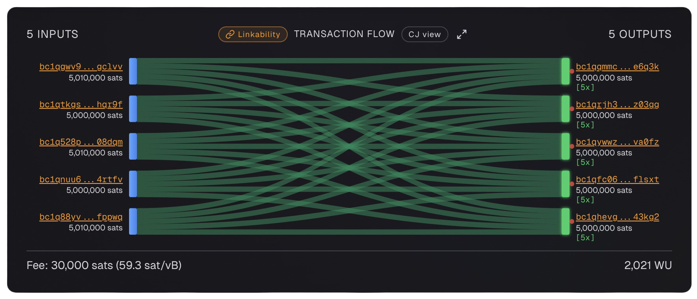
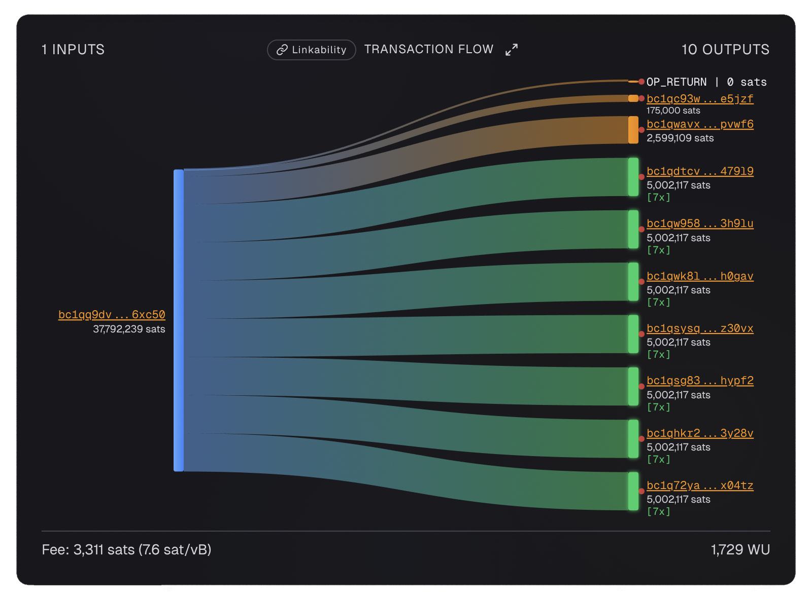
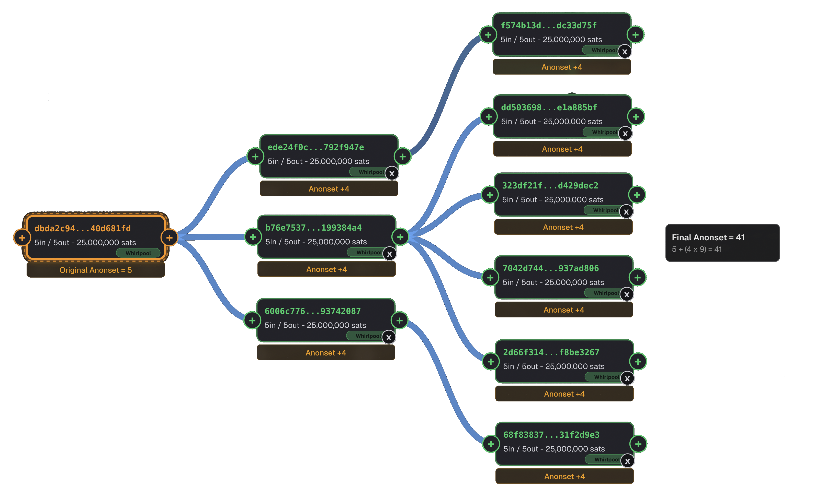

# Whirlpool

[Whirlpool](../../glossary.md#whirlpool) is a [CoinJoin](../../glossary.md#coinjoin) implementation originally developed by [Samourai Wallet](../../glossary.md#samourai-wallet). It uses a fixed-denomination model to create privacy on the Bitcoin blockchain.

!!! info "Other CoinJoin Implementations"

    Whirlpool is one of several CoinJoin implementations. Others include [JoinMarket](joinmarket.md) (decentralized, [maker](../../glossary.md#maker)-[taker](../../glossary.md#taker) model) and [Wasabi Wallet](wasabi.md) ([WabiSabi](../../glossary.md#wabisabi) protocol, 20+ participants). Each has different trade-offs in terms of privacy, convenience, and censorship resistance.

---

## What Is Whirlpool?

Whirlpool is a CoinJoin protocol where participants come together to mix their bitcoin. Each participant contributes one input of a specific denomination and receives one output of the same denomination.

!!! tip "How It Works"

    Example: 5 users each contribute 0.1 BTC. The coordinator combines all 5 inputs and creates 5 outputs of 0.1 BTC each. An outside observer cannot tell which input funded which output.

---

## Whirlpool Transaction Example

The image below shows a Whirlpool CoinJoin transaction as visualised by [am-i.exposed](https://am-i.exposed). Notice the beautiful equal outputs at a fixed denomination — the signature pattern of Whirlpool.

{ loading=lazy }

---

## How Whirlpool Works

### The Four Accounts

Whirlpool wallets use 4 distinct accounts to support the coinjoin process:

| Account | Index | Purpose |
|---------|-------|---------|
| **Deposit** | `0'` | Where you receive unmixed bitcoin |
| **Premix** | `2147483645'` | [UTXOs](../../glossary.md#utxo) waiting to enter a round |
| **Postmix** | `2147483646'` | Mixed UTXOs after completing rounds |
| **Bad Bank** | `2147483644'` | [Doxxic change](../../glossary.md#doxxic-change) from Tx0 transactions |

### The Mixing Process

=== "Step 1: Create the Tx0"

    When you initiate a mix, your wallet creates a [Tx0](../../glossary.md#tx0) transaction. This takes your deposit UTXO(s) and splits them into equal-sized premix outputs. Any leftover bitcoin becomes **[doxxic change](../../glossary.md#doxxic-change)**.

=== "Step 2: Enter the Queue"

    Your premix UTXOs enter the queue. You choose a [cycle priority](../../glossary.md#cycle-priority) (low, normal, or high) which determines how quickly your first mix will occur based on mining fee rates.

=== "Step 3: Complete the Mix"

    When enough participants are ready, the CoinJoin round executes. You receive post-mix outputs of the same denomination, mixed with other participants.

=== "Step 4: Remix"

    Post-mix UTXOs can automatically enter additional rounds (remixes) to increase your [anonymity set](../../glossary.md#anonymity-set). Each remix costs no additional service or mining fees.

---

## Whirlpool Denominations

Whirlpool uses fixed denominations to make the CoinJoin outputs indistinguishable from each other.

### Original Samourai Pools

When Whirlpool was first launched by Samourai Wallet, these were the available pool sizes:

| Denomination | Sats | Use Case |
|-------------|------|----------|
| **0.0005 BTC** | 50,000 | Small amounts, testing |
| **0.001 BTC** | 100,000 | Small payments |
| **0.01 BTC** | 1,000,000 | Medium amounts |
| **0.05 BTC** | 5,000,000 | Larger amounts |
| **0.5 BTC** | 50,000,000 | Large holdings |

### Current Ashigaru Pools

Today, [Ashigaru](https://ashigaru.rs) offers two active pools:

| Denomination | Entry Fee | Sats |
|-------------|-----------|------|
| **0.025 BTC** | 0.00125 BTC | 2,500,000 |
| **0.25 BTC** | 0.0125 BTC | 25,000,000 |

The original Samourai pool sizes may return in the future, but for now only these two are available.

!!! warning "Fixed Denominations Matter"

    The fixed denominations are what make Whirlpool effective. If outputs were different sizes, they could be linked to specific inputs.

---

## Understanding Tx0: The Preparation Step

Before your coins can enter a Whirlpool round, they need to be prepared. This is what the Tx0 transaction does.

### What Tx0 Actually Does

Tx0 is the preparation step. Before your coins can enter a Whirlpool round, they need to be split into pieces that match the pool's denomination. Your wallet takes your deposit UTXO and chops it into equal-sized premix outputs.

Each premix output is slightly larger than the pool denomination — the extra sats cover the mining fee that will be paid when this premix UTXO eventually enters the actual CoinJoin round.

### A Real Tx0 Example

The image below shows a real Tx0 transaction from the Samourai Wallet era:

{ loading=lazy }

- **Transaction ID:** [`cc27f73a...`](https://am-i.exposed/#tx=cc27f73a536bed8edb60f580f43b5cb75a17e940fc40fce7f6e710353b0a18da)
- **Block:** #707,908
- **Date:** November 2, 2021

??? note "View the Tx0 Output Breakdown"

    | Output | Amount (BTC) | Purpose |
    |--------|-------------|---------|
    | 7 outputs | 0.05002117 each | Premix UTXOs (going to the premix account) |
    | 1 OP_RETURN | 0 | [Coordinator fee](../../glossary.md#coordinator-fee) |
    | 1 output | 0.00175000 | Whirlpool pool entry fee |
    | 1 output | 0.02599109 | Doxxic change (going to the Bad Bank account) |

    **Input:** 0.37792239 BTC (from the deposit account)

    In this example, the user wanted to join the 0.05 BTC pool. Their wallet took their single deposit of 0.37792239 BTC and split it into 7 equal premix outputs of 0.05002117 BTC each. The extra 2,117 sats per output cover the mining fee for the future CoinJoin round.

### The Doxxic Change Problem

After creating premix outputs, there is often leftover bitcoin. This leftover is called [doxxic change](../../glossary.md#doxxic-change) — and it's a privacy risk.

This change has **not** been mixed. It is still linked to the user's original deposit. If you were to spend this change together with your mixed coins, you would instantly connect your clean (mixed) coins to your dirty (unmixed) history, wiping out all the privacy benefits you just paid for.

That's why Whirlpool sends doxxic change to a separate account called the "Bad Bank." This keeps toxic (unmixed) UTXOs physically separated from clean (mixed) ones in your wallet, making it much harder to accidentally combine them.

### The Fee Structure

Tx0 involves two fee-related outputs:

1. **[Coordinator fee](../../glossary.md#coordinator-fee) (OP_RETURN):** This is the service fee paid to the Whirlpool coordinator for running the mixing service. It's written as an [OP_RETURN](../../glossary.md#op_return) output — a way to embed data in the blockchain that doesn't carry any bitcoin value.

2. **Pool entry fee:** This is the one-time fee you pay to enter the pool. Once you've paid it, all your future remixes are completely free — no extra service fees, no extra mining fees.

!!! tip "Bigger Tx0 = Better Fee Deal"

    The bigger your Tx0 input, the better the fee deal. Since you only pay the entry fee once per Tx0, getting more premix outputs from a single transaction means the fee gets spread across more coins. If you create 7 premix outputs from one entry fee payment, the effective fee per output is much smaller than if you had only created one or two.

!!! info "This Example Is from the Samourai Era"

    This transaction is from November 2021, when Samourai Wallet was still actively maintained. Today, Whirlpool is performed through [Ashigaru](https://ashigaru.rs), which continues the same protocol. The Samourai founders were arrested in April 2024, but the Whirlpool technology lives on through Ashigaru.

---

## Forward-Looking Anonymity Sets

A Whirlpool round starts with 5 equal outputs, but your privacy is not limited to only those 5 outputs forever. Whirlpool is designed so that post-mix [UTXOs](../../glossary.md#utxo) can keep remixing. Each time you or one of your original mixing peers remixes, the crowd you are hiding in can grow.

!!! tip "The Crowd Can Grow Even If You Do Nothing"

    Imagine your first Whirlpool round creates 5 equal outputs. One of them is yours, but nobody watching the blockchain can tell which one.

    If one of the other 4 outputs later remixes, that remix creates more equal outputs that are also connected to your original round. Your own UTXO did not move, but the number of possible paths an observer must consider increased.

This is called a **forward-looking anonymity set**. It looks forward from your first mix and counts the equal-denomination outputs that could plausibly be yours as remixing continues.

### Why This Matters

A normal explanation of CoinJoin often says "you hide in a crowd of 5." That is true at the moment of a standard 5-person Whirlpool round, but it is incomplete.

Because Whirlpool allows free remixes, the crowd can grow over time:

- If your own UTXO remixes, your forward-looking anonymity set grows
- If one of your original mixing peers remixes, your forward-looking anonymity set can also grow
- If those later outputs keep remixing, the possible paths keep expanding

From the outside, all equal-denomination Whirlpool outputs look the same. An observer cannot know which one is yours, so they must consider all plausible equal-output paths.

### How the Count Grows

In a simple 5-output Whirlpool round, the starting anonymity set is 5. If one of those 5 outputs later remixes into another normal 5-output Whirlpool round, the set grows from 5 to 9.

Why 9 and not 10? Because the original output that remixed has now been spent. It is replaced by 5 new equal outputs, so the net gain is 4.

??? note "Simple one-generation count"

    | Original outputs that later remix | Forward-looking anonymity set |
    |---|---|
    | 0 | 5 |
    | 1 | 9 |
    | 2 | 13 |
    | 3 | 17 |
    | 4 | 21 |
    | 5 | 25 |

This assumes each original output enters a separate normal 5-output Whirlpool round and that we are only counting one generation of remixes. If those new outputs later remix again, the tree keeps expanding. For a larger [Surge Cycle](../../glossary.md#surge-cycle), the same idea applies: a remixed output is replaced by the new round's equal outputs, so the net growth is the number of equal outputs in that new round minus 1.

??? note "Simple rule of thumb"

    For a normal 5-output Whirlpool remix, each newly remixed branch adds **4** to the forward-looking anonymity set.

    Another way to think about it is: every time one eligible Whirlpool output remixes into a normal 5-output round, the old output disappears and 5 new equal outputs appear.

    $$5 - 1 = 4$$

### Example: Anonset 5 Growing to 41

The graph below shows a real section of the Bitcoin transaction graph visualized with the [am-i.exposed transaction graph explorer](https://am-i.exposed/graph/?network=mainnet#graph=AgAKAAAAAADb2iyUo0Ndbat7jjcmmtQPLzd1GXY-Eb6PvoHOQNaB_QAA__8A7eJPDK2EyeRdTBATZC9_wJklZBjIgEkiI9EQXnkvlH4BAQAAArdudTcgSWBXicrnnWBjW-H6SD0dLId6BeyT-5sZk4SkAQEAAANgBsd2JJT9Y95Rw1b_ONfHBdahC2E4xX-aAk6Tk3QghwEBAAAEaPg4N1Xg_dgTCL-Hi3WPcVCM1EJ373oDvYh3_jHy2eMCAQADAt1QNpilG584gSGZYzSKtOZmoqEJGbcTAeMN_YXhqIW_AgEAAgEyPfIfCwdW-YM2Q3qj0vuH4CtZ8ZRrcUp7Cd8E1CnewgIBAAICcELXRM-3_ofJsrzv6hOBcGSkUKKnOHy1tAzK_JN62AYCAQACAy1m8xT7BUTqP2iJdIZPErEJq0hhF9rw_5xHkIr4vjJnAgEAAgT1dLE9xOfaDM2lDkjN5_YbWOcT59LgDs58z0xt3DPXXwIBAAECAAoAAUSxAADBcAAAAAJEsKAAQrQAAAADRLCAAENHAAAAAESLAABCtc3CAARE12qrQ7QqqwAFRNcKq8KGAAAABkTXNVVCDAAAAAdE10qrQw8AAAAIRNdgAEN8qqsACUTW9VXDLgAAAAoAAgpBbm9uc2V0ICs0AAMKQW5vbnNldCArNAABCkFub25zZXQgKzQACQpBbm9uc2V0ICs0AAUKQW5vbnNldCArNAAGCkFub25zZXQgKzQABwpBbm9uc2V0ICs0AAgKQW5vbnNldCArNAAECkFub25zZXQgKzQAABRPcmlnaW5hbCBBbm9uc2V0ID0gNQABAETzIABCy1VVQxSqq0JCqqsSRmluYWwgQW5vbnNldCA9IDQxAAA). Each rectangle is a normal 5-input, 5-output Whirlpool transaction.

{ loading=lazy }

??? example "View the anonset calculation"

    The original Whirlpool transaction starts with an anonymity set of **5**.

    Three outputs from the original transaction later remix:

    $$5 + (3 \times 4) = 17$$

    Then the next layer expands again:

    - Two of those remix transactions each have **1 output** that remixes again: $2 \times 4 = 8$
    - The third remix transaction has **4 outputs** that remix again: $4 \times 4 = 16$

    Final count:

    $$17 + 8 + 16 = 41$$

    Or, more simply, there are **9 total remix events** shown after the original transaction:

    $$5 + (9 \times 4) = 41$$

    And in reality there are hundreds of remixes that span out from this exact example (I have just shown a small segment of the transaction graph to help you understand) so you can imagine the massive anonset.

### How Free Remixing Works

Whirlpool remixes are free because the mining fees for a CoinJoin round are paid by new entrants, not by the remixers.

A typical Whirlpool round includes:

| Participant type | Role | Fee behavior |
|---|---|---|
| **Premixer** | New UTXO entering the pool | Pays the mining fee contribution |
| **Peer premixer** | Another new UTXO entering the pool | Also pays the mining fee contribution |
| **Remixers** | UTXOs that have already mixed before | Join the round for free |

When you create a [Tx0](../../glossary.md#tx0), your premix outputs are made slightly larger than the pool denomination. That small extra amount helps pay the mining fee when those premix outputs enter their first CoinJoin round. Once a UTXO has completed its first mix and stays in the correct pool denomination, it can be selected for future remixes without paying again.

??? info "Why Remixers Are Important"

    Remixers are sometimes called "freeriders" because they do not pay additional fees for that round. But they are not useless passengers. They are part of what makes Whirlpool work.

    Remixers give new entrants more privacy, and new entrants pay the mining fees that allow remixers to keep cycling. This creates a feedback loop: new liquidity helps old liquidity remix, and old liquidity gives new liquidity a larger crowd.

### Staying Eligible to Remix

To get free remixes, your wallet needs to be online and communicating with the Whirlpool coordinator. If your wallet is offline, your UTXOs cannot be selected as remixers.

!!! tip "Patience Improves Whirlpool Privacy"

    You do not need to rush out of Whirlpool immediately after the first mix. If you keep post-mix UTXOs in the postmix account, they can continue to benefit from remixes over time.

    More time in the pool can mean a larger forward-looking anonymity set before you eventually spend.

### Important Limits

Forward-looking anonymity sets are useful, but they are not magic.

- They only help if you avoid bad post-mix spending
- They can be damaged by [consolidation](../../analysis/consolidation.md)
- They do not protect you if you spend mixed and unmixed coins together

The basic rule stays the same: let post-mix UTXOs remix, spend them carefully, and never merge them with doxxic change or unrelated UTXOs.

---

## Whirlpool Fees

Whirlpool charges a [coordinator fee](../../glossary.md#coordinator-fee) for each Tx0. Remixes cost nothing extra — no additional service or mining fees.

### Original Samourai Fees

These were the fees when Samourai Wallet offered all five pool sizes:

| Denomination | Fee | Percentage |
|-------------|-----|------------|
| 0.0005 BTC | 0.000005 BTC | 1% |
| 0.001 BTC | 0.00001 BTC | 1% |
| 0.01 BTC | 0.0001 BTC | 1% |
| 0.05 BTC | 0.0005 BTC | 1% |
| 0.5 BTC | 0.005 BTC | 1% |

### Current Ashigaru Fees

On Ashigaru, only two pools are currently active:

| Denomination | Entry Fee | Percentage |
|-------------|-----------|------------|
| 0.025 BTC | 0.00125 BTC | 5% |
| 0.25 BTC | 0.0125 BTC | 5% |

The fee is a one-time payment when you enter the pool. All remixes after that are free.

---

## Surge Cycles

Whirlpool also supports rounds with more than 5 participants. These are called "[Surge Cycles](../../glossary.md#surge-cycle)" and can include 6, 7, 8, 9, or 10 people instead of the original 5.

### How Surge Cycles Work

Surge Cycles were introduced to make better use of mining fees. Here's how they happen:

When you enter Whirlpool, you choose a [cycle priority](../../glossary.md#cycle-priority) — low, normal, or high. This determines the mining fee rate your premix UTXOs can support. The Whirlpool coordinator also sets a "trigger fee rate" based on current network conditions.

If mining fees on the Bitcoin network suddenly drop after your premix UTXOs have already committed to a higher fee rate, there's a surplus of mining fees available. Instead of wasting this surplus, the coordinator adds more [remixers](../../glossary.md#remixer) to the round, making the transaction larger and using up the extra fees efficiently.

### Benefits of Surge Cycles

- **Better fee efficiency:** Your premix UTXOs get more privacy for the same mining fee
- **Higher anonymity sets:** More participants means more possible interpretations
- **Faster remixing:** Remixers get mixed more frequently
- **No client update needed:** Surge Cycles are handled entirely by the coordinator

The privacy model stays the same: every output looks identical, so nobody can tell which input belongs to which output.

??? info "Read the Original Surge Cycles Announcement"

    Surge Cycles were introduced by Samourai Wallet in June 2023. Read the full announcement: [Introducing Whirlpool Surge Cycles](https://medium.com/samourai-wallet/introducing-whirlpool-surge-cycles-b5b484a1670f)

!!! tip "See Whirlpool Entropy Analysis"

    Want to see the math behind Whirlpool's privacy? The [Boltzmann entropy analysis](../../analysis/whirlpool.md) page breaks down exactly how many valid interpretations a Whirlpool transaction has, what the link probability matrix looks like, and why the 34.2% figure matters. It's a deep dive into the mathematical foundation of Whirlpool's privacy guarantees.

---

## Spending the Doxxic Change

Remember: Whirlpool's model equalizes coins in the Tx0 before entering pools, which makes tracking harder. This is the most effective coinjoin model, but it has a drawback: a change output that does not go through the coinjoin process, we call this **[doxxic change](../../glossary.md#doxxic-change)**.

This change output is created for each Tx0. It is isolated in a specific account named `Doxxic Change` or `Bad Bank` depending on the software to avoid using it with your other [UTXOs](../../glossary.md#utxo). This point is critical: these UTXOs have not been mixed — their traceability links remain intact and can compromise your privacy by tying you to your coinjoin activity. Handle them carefully and never use them with other UTXOs, mixed or not. **Combining a toxic UTXO with a mixed UTXO destroys all privacy gains from coinjoins.**

Currently, Ashigaru does not provide direct access to the `Doxxic Change` account, at least it wasn't found at the time of writing. This feature will likely be added in a future update. In the meantime, the only way to retrieve these funds is to import your seed into Sparrow Wallet. Sparrow usually auto-detects a Whirlpool wallet and gives access to all four accounts, including `Bad Bank`. You can then spend those UTXOs like regular bitcoin from Sparrow.

Here are several possible strategies to handle coinjoin change UTXOs without compromising your privacy:

-   :material-shuffle:{ .lg .middle } __Mix Them in Smaller Pools__

    ---

    If a toxic UTXO is large enough for a smaller pool, this is often the best option. Do not merge multiple toxic UTXOs to reach the threshold — that would link your entries.

-   :material-lock:{ .lg .middle } __Mark Them as Unspendable__

    ---

    Another cautious approach is to keep them in their separate account and not touch them to avoid accidental spending. If BTC appreciates, new pools may become available for their size.

-   :material-gift:{ .lg .middle } __Donate Them__

    ---

    You can donate toxic UTXOs to Bitcoin developers, open-source projects, or nonprofits that accept BTC. This disposes of them usefully while supporting the ecosystem.

-   :material-card-account-details:{ .lg .middle } __Buy Gift Cards or Prepaid Cards__

    ---

    Platforms like [Bitrefill](https://www.bitrefill.com/) allow exchanging bitcoin for gift cards or reloadable Visa cards. This can be a simple, discreet way to spend toxic UTXOs. But be aware that these UTXOs are still linked to their previous history so be careful which ones you spend.

-   :material-swap-horizontal:{ .lg .middle } __Swap Them for Monero__

    ---

    Samourai Wallet previously offered atomic BTC/XMR swaps, now discontinued. This service exists in [Eigen Wallet](https://eigenwallet.org/). You can isolate these UTXOs, convert to XMR, then back to BTC if desired. This method can be costly and depends on available liquidity. Also consider whether you want to potentially risk a UTXO that may be associated with you being given to a third party who can do whatever they want with it.

-   :material-lightning-bolt:{ .lg .middle } __Open a Lightning Channel__

    ---

    Transferring toxic UTXOs to LN to benefit from lower transaction fees can be useful. However, this may leak information depending on your LN usage, so proceed carefully.

!!! danger "Handle Doxxic Change Carefully"

    Carefully consider what you want to do with your doxxic change, always proceed carefully.

---

## How to Manage Postmix

After several coinjoin cycles, the best strategy is to keep [UTXOs](../../glossary.md#utxo) in the `Postmix` account, letting them remix indefinitely until you actually need to spend them.

Some users prefer moving mixed BTC to a hardware wallet. This is possible, but it requires discipline to avoid compromising privacy gains from coinjoins.

=== "Never Merge Mixed and Unmixed UTXOs"

    The most common mistake is merging UTXOs. Never combine mixed UTXOs with unmixed UTXOs in the same transaction, or you risk creating links via the [CIOH](../../glossary.md#cioh). This means rigorous UTXO management is key — clear and precise labeling is essential. In general, UTXO merging is risky and often leads to privacy loss when done poorly.

=== "Be Careful with Consolidation"

    Be careful with consolidation of mixed UTXOs with each other, too. Limited consolidation may be acceptable if UTXOs have large anonsets, but it inevitably reduces your privacy. Avoid large or rushed consolidations before sufficient remixes, as they can create deducible links between your coins before and after mixing. When in doubt, do not consolidate postmix UTXOs. Instead, transfer them one by one to your hardware wallet, generating a fresh receiving address each time. Label every transferred UTXO carefully.

=== "Avoid Minority Script Types"

    It is strongly discouraged to move postmix UTXOs into wallets using minority [script types](../../glossary.md#script-type). For example, if you participated in Whirlpool from a multisig `P2WSH` wallet, few users share that script type. Sending postmix UTXOs back to the same script greatly reduces your [anonymity set](../../glossary.md#anonymity-set). Beyond script type, other [wallet fingerprints](../../glossary.md#wallet-fingerprint) can harm your privacy. The safest option is to spend from the Ashigaru app.

=== "Never Reuse Addresses"

    Finally, as with any Bitcoin usage, never reuse a receiving address. Each payment should go to a fresh, unused address.

The simplest and safest method remains: keep mixed UTXOs resting in `Postmix`, let them remix naturally, and spend only when needed from Ashigaru.

Ashigaru and Sparrow include additional protections against common [chain analysis](../../glossary.md#chain-analysis) pitfalls, helping you preserve transaction privacy.

!!! warning "Postmix Best Practices"

    Avoid merging mixed and unmixed UTXOs; prefer spending from Postmix directly; don't reuse addresses; and be cautious with script types and consolidations.

---

## Whirlpool Best Practices

-   :material-shuffle:{ .lg .middle } __Let Coins Remix__

    ---

    One round breaks deterministic links, but free remixes can grow your forward-looking anonymity set over time.

-   :material-timer:{ .lg .middle } __Wait Between Rounds__

    ---

    Do not do all your rounds in quick succession. Wait hours or days between rounds.

-   :material-hand-back-right-off:{ .lg .middle } __Never Spend Post-Mix Together__

    ---

    Each post-mix output should be spent independently. Never combine them.

-   :material-incognito:{ .lg .middle } __Use Tor__

    ---

    Always route Whirlpool through Tor. Samourai Wallet supports this natively.

-   :material-label:{ .lg .middle } __Label Your Outputs__

    ---

    Keep track of which UTXOs are post-mix. Never mix them with premix.

-   :material-shield-check:{ .lg .middle } __Use Ashigaru Terminal__

    ---

    Ashigaru Terminal has built-in Whirlpool support, you can learn more [here](https://planb.academy/en/tutorials/privacy/on-chain/ashigaru-terminal-9a0d46d3-33b9-4c64-84c5-bfa25b3a0add).

---

## Whirlpool and Ashigaru

[Ashigaru](https://ashigaru.rs) is now the primary wallet for Whirlpool. It provides all the features originally offered by Samourai Wallet when combined with Ashigaru Terminal:

- **Deposit**: Where you deposit Bitcoin before initiating a Tx0
- **Premix**: Where you hold bitcoin before mixing
- **Post-mix**: Where you receive mixed bitcoin
- **Bad Bank**: A pool of post-mix UTXOs that have been through many rounds

Ashigaru continues to be actively maintained by an anonymous team committed to Bitcoin privacy and user sovereignty.

!!! info "Whirlpool Is Now Done via Ashigaru"

    [Ashigaru](https://ashigaru.rs) is a Bitcoin wallet that continues the Samourai Wallet project in a new form. In April 2024, the founders of Samourai Wallet were arrested by American authorities and their servers were seized. While the original Samourai app remained usable for a time, it is no longer maintained.

    Ashigaru is a free, open-source fork maintained by an anonymous team to preserve Samourai's functionality and original philosophy: defending the privacy and sovereignty of Bitcoin users. All Whirlpool CoinJoin features are now accessed through Ashigaru.

    Excellent guides on using Ashigaru Whirlpool from [Loïc Morel](https://github.com/LoicPandul) can be found on [planb academy](https://planb.academy/en/tutorials/privacy).

---

## Common Whirlpool Mistakes

=== "Spending Post-Mix UTXOs Together"

    This is the single most damaging mistake. It completely destroys the forward looking anonset you could achieve.

=== "Doing Only One Round"

    One round is enough to break deterministic links, multiple rounds are free and increase the forward looking anonset.

=== "Mixing KYC and Non-KYC"

    Do not mix KYC bitcoin with non-KYC bitcoin in Whirlpool. Keep them separate.

=== "Consolidating Pre-Mix UTXOs"

    Combining multiple pre-mix UTXOs in a single transaction links those UTXOs, even though they are CoinJoined after there is a record on the permanent blockchain stating that those UTXOs likely had the same owner.

---

## References

- [Loïc Morel's Educational Content](https://pandul.fr/) — Comprehensive Bitcoin privacy tutorials and guides
- [Track Me If You Can — How Bitcoin Forward-Looking Anonymity Sets Work](https://bitcoinmagazine.com/technical/how-bitcoin-anonymity-sets-work) — Explanation of Whirlpool forward-looking anonymity sets
- [Introducing Whirlpool Surge Cycles](https://medium.com/samourai-wallet/introducing-whirlpool-surge-cycles-b5b484a1670f) — Original Surge Cycles announcement from Samourai Wallet
- [Whirlpool Boltzmann Analysis](../../analysis/whirlpool.md) — Detailed entropy and link probability analysis of Whirlpool transactions
